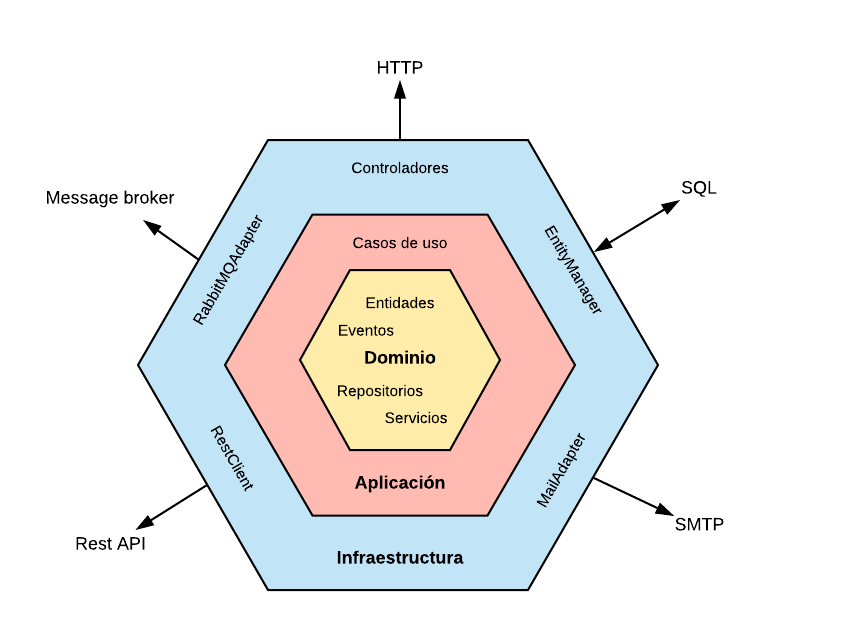

# Hexagonal Architecture (Ports and Adapters) Overview

> **Navigation:** **Architecture Overview** | [Testing Strategy](../testing/testing-strategy.md) | [Dependencies](../testing/dependencies.md) | [BDD](../testing/bdd/bdd-strategy.md) | [TDD](../testing/tdd/tdd-strategy.md) | [JUnit & Mockito Standards](../testing/tdd/junit-mockito-assertj.md)

This document provides a comprehensive architectural explanation of this project, which serves as a hands-on learning and reference implementation for **Hexagonal Architecture** (also known as *Ports and Adapters*) combined with **Domain-Driven Design (DDD)** and **Clean Architecture** principles in **Spring Boot (Java 21)**.

---

## Table of Contents

1. [Architectural Representation](#1-architectural-representation)
2. [Layer-by-Layer Explanation](#2-layer-by-layer-explanation)
   - [Layer 1: Dominio / Domain (Inner Core)](#layer-1-dominio--domain-yellow-inner-core)
   - [Layer 2: Aplicación / Application (Middle Ring)](#layer-2-aplicación--application-middle-ring)
   - [Layer 3: Infraestructura / Infrastructure (Outer Ring)](#layer-3-infraestructura--infrastructure-blue-outer-ring)
3. [Request Flow Example: Creating a User](#3-request-flow-example-creating-a-user)
4. [Key Architectural Benefits](#4-key-architectural-benefits)

---

## 1. Architectural Representation

The following diagram illustrates the concentric layers, boundaries, and communication flow of the system:



---

## 2. Layer-by-Layer Explanation

The architecture is divided into three concentric layers, where **dependencies strictly point inward**. The inner layers know nothing about the outer layers.

```text
               ┌────────────────────────────────────────────────────────┐
               │              INFRASTRUCTURE (Adapters)                │
               │   (Web Controllers, JPA Persistence, Messaging, etc.)  │
               │                                                        │
               │        ┌──────────────────────────────────────┐        │
               │        │        APPLICATION (Use Cases)       │        │
               │        │   (In/Out Ports, Commands, Services) │        │
               │        │                                      │        │
               │        │        ┌────────────────────┐        │        │
               │        │        │   DOMAIN (Core)    │        │        │
               │        │        │ (Entities, VOs,    │        │        │
               │        │        │  Exceptions)       │        │        │
               │        │        └────────────────────┘        │        │
               │        └──────────────────────────────────────┘        │
               └────────────────────────────────────────────────────────┘
```

---

### Layer 1: Dominio / Domain (Yellow Inner Core)
* **Package:** `com.backend.hexagonal.domain`
* **Contents:**
  * `model/`: Objects related to business rules and domain identity (`User` with self-generated `UUID`).
  * `exception/`: Classes related to business rule violation exceptions (`InvalidUserDataException`).
* **Golden Rules:**
  * > **100% Pure Java:** Zero dependencies on external frameworks (no Spring `@Component`, no Jakarta `@Entity`, no Jackson annotations).
  * > **Encapsulation of Invariants:** Objects validate their own state (e.g., email format and name validation happen inside the Domain Object).

---

### Layer 2: Aplicación / Application (Middle Ring)
* **Package:** `com.backend.hexagonal.application`
* **Contents:**
  * `port/in/`: Driving / Inbound Ports defining use case contracts:
    - `CreateUserUseCase.java`
    - `GetByIdUserUseCase.java`
    - `GetAllUserUseCase.java`
    - `UpdateUserUseCase.java`
    
    And input command/query records are encapsulated within each use case package (e.g., `CreateUserCommand`, `UpdateUserCommand`). These records handle input data cleanly across the boundary.

  * `port/out/`: Driven / Outbound Ports defining requirements from the outside world (`UserRepositoryPort.java`). These define what the application needs from external systems, and their implementation occurs strictly in the infrastructure layer.
  
  * `service/`: Use case implementations (`CreateUserService.java`, `GetByIdUserService.java`, `GetAllUserService.java`, `UpdateUserService.java`).

* **Golden Rules:**
  * > Orchestrates business flows by validating domain rules, executing domain state changes, and calling output ports.
  * > The application layer is completely agnostic of infrastructure details (it does not know whether requests come from HTTP REST, gRPC, or CLI, nor whether data lives in PostgreSQL, H2, or in-memory).

---

### Layer 3: Infraestructura / Infrastructure (Blue Outer Ring)
* **Package:** `com.backend.hexagonal.infrastructure`
* **Contents:**
  * **Inbound Adapters (`adapter/in/web/`):**
    * `controller/`: Handles incoming HTTP REST requests.
    * `dto/`: HTTP request/response payloads (`UserRequest`, `UserResponse`).
    * `mapper/`: Translates HTTP DTOs $\leftrightarrow$ Input Port Commands / Domain Models.
    * `exception/`: Translates Domain/Application exceptions into HTTP status codes via `@RestControllerAdvice` (e.g., 400 Bad Request, 404 Not Found, 409 Conflict).
    
  * **Outbound Adapters (`adapter/out/persistence/`):**
    * `UserRepositoryAdapter.java`: Implements the `UserRepositoryPort` output port.
    * `entity/`: Database-specific JPA mapping (`UserJpaEntity` with `@Entity`, `@Table`, `@Id`).
    * `mapper/`: Translates Domain `User` $\leftrightarrow$ `UserJpaEntity`.
    * `repository/`: Spring Data JPA interface (`JpaRepository`).

  * **Configuration (`config/`):**
    * `BeanConfiguration.java`: Wires application services as Spring beans without annotating the application layer with framework-specific annotations like `@Service`.

---

## 3. Request Flow Example: Creating a User

```text
1. Client sends HTTP POST /api/v1/users (JSON payload)
   │
   ▼
2. [Inbound Adapter] UserController receives UserRequest
   │
   ▼
3. [Mapper] Translates UserRequest -> CreateUserCommand
   │
   ▼
4. [Input Port] CreateUserUseCase.execute(command) is invoked
   │
   ▼
5. [Application Service] CreateUserService coordinates the creation:
   - Instantiates Domain User (generates UUID, self-validates invariants)
   - Checks business rule via UserRepositoryPort.existsByEmail(email)
   │
   ▼
6. [Output Port] CreateUserService calls UserRepositoryPort.save(user)
   │
   ▼
7. [Outbound Adapter] UserRepositoryAdapter persists the entity:
   - Maps Domain User -> UserJpaEntity
   - Saves to database via Spring Data Repository
   - Maps saved UserJpaEntity back -> Domain User
   │
   ▼
8. [Response] Controller maps Domain User -> UserResponse and returns HTTP 201 Created
```

---

## 4. Key Architectural Benefits

1. **Testability:** The core business domain and application use cases can be unit-tested in milliseconds without spinning up Spring Boot, databases, or mock web servers.
2. **Maintainability & Evolution:** Swapping technical details (e.g. changing PostgreSQL to DynamoDB or switching from REST to gRPC) only requires creating a new adapter without touching domain or application logic.
3. **Separation of Concerns:** Technical requirements (annotations, HTTP status codes, SQL queries) never pollute domain business rules.

---

[▲ Back to Top](#hexagonal-architecture-ports-and-adapters-overview) | [Testing Strategy →](../testing/testing-strategy.md) | [TDD Strategy →](../testing/tdd.md)
