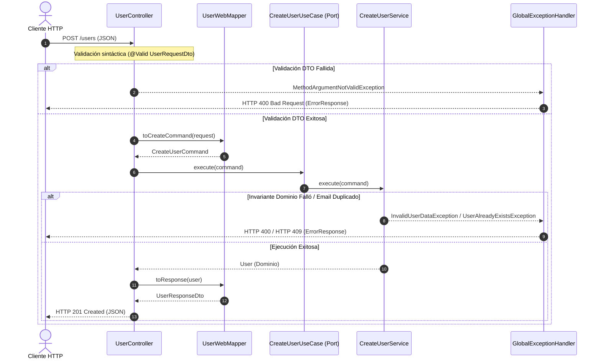
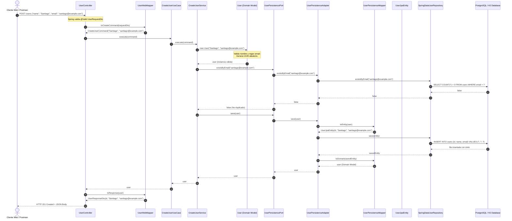

# GUÍA MAESTRA DE ARQUITECTURA HEXAGONAL (PORTS & ADAPTERS)
## Referencia Completa, Flujos de Ejecución, Diseño y Testing en Spring Boot (Java 21)

---

> **Propósito de este documento:**  
> Este documento es una guía exhaustiva y autocontenida de estudio y repaso sobre la arquitectura del proyecto. Ha sido diseñada para que cualquier desarrollador pueda leerla tras semanas o meses de inactividad y comprender de inmediato el **porqué**, el **cómo** y el **dónde** de cada decisión técnica, patrón de diseño, clase, flujo de datos y estrategia de testing.

---

## TABLA DE CONTENIDOS

1. [Estructura General del Proyecto](#1-estructura-general-del-proyecto)
2. [Arquitectura Hexagonal: Fundamentos y Modelo Conceptual](#2-arquitectura-hexagonal-fundamentos-y-modelo-conceptual)
3. [Capa de Dominio (Domain Core)](#3-capa-de-dominio-domain-core)
4. [Capa de Aplicación (Application Layer)](#4-capa-de-aplicación-application-layer)
   - [Input Ports (Casos de Uso)](#input-ports-casos-de-uso)
   - [Output Ports (Puertos de Salida)](#output-ports-puertos-de-salida)
5. [Servicios de Aplicación (Application Services)](#5-servicios-de-aplicación-application-services)
6. [Commands (Patrón Command y DTOs de Entrada)](#6-commands-patrón-command-y-dtos-de-entrada)
7. [Capa de Infraestructura (Infrastructure Layer)](#7-capa-de-infraestructura-infrastructure-layer)
8. [Inbound Adapter — Web (Controlador REST y HTTP)](#8-inbound-adapter--web-controlador-rest-y-http)
9. [Outbound Adapter — Persistence (JPA, Entidades y Mappers)](#9-outbound-adapter--persistence-jpa-entidades-y-mappers)
10. [Configuración de Beans e Inversión de Control](#10-configuración-de-beans-e-inversión-de-control)
11. [Inyección de Dependencias (Dependency Injection)](#11-inyección-de-dependencias-dependency-injection)
12. [Flujo Detallado Paso a Paso: Crear Usuario (POST /users)](#12-flujo-detallado-paso-a-paso-crear-usuario-post-users)
13. [Flujo Detallado Paso a Paso: Consultar Usuarios (GET /users y GET /users/{id})](#13-flujo-detallado-paso-a-paso-consultar-usuarios-get-users-y-get-usersid)
14. [Flujo Detallado Paso a Paso: Actualizar Usuario (PUT /users/{id})](#14-flujo-detallado-paso-a-paso-actualizar-usuario-put-usersid)
15. [Flujo Detallado Paso a Paso: Eliminar Usuario (DELETE /users/{id})](#15-flujo-detallado-paso-a-paso-eliminar-usuario-delete-usersid)
16. [Manejo Global de Excepciones y Mapeo HTTP](#16-manejo-global-de-excepciones-y-mapeo-http)
17. [Arquitectura de Pruebas (Testing Pyramid)](#17-arquitectura-de-pruebas-testing-pyramid)
18. [Pruebas Unitarias de Servicios (Application Service Tests)](#18-pruebas-unitarias-de-servicios-application-service-tests)
19. [Pruebas de Integración de Persistencia (DataJpaTest)](#19-pruebas-de-integración-de-persistencia-datajpatest)
20. [Pruebas Web Slice de Controladores (WebMvcTest)](#20-pruebas-web-slice-de-controladores-webmvctest)
21. [TDD (Test-Driven Development)](#21-tdd-test-driven-development)
22. [BDD (Behavior-Driven Development) y Cucumber](#22-bdd-behavior-driven-development-y-cucumber)
23. [Análisis de Dependencias Gradle (build.gradle)](#23-análisis-de-dependencias-gradle-buildgradle)
24. [Matriz de Dependencias entre Capas vs. Flujo de Control](#24-matriz-de-dependencias-entre-capas-vs-flujo-de-control)
25. [Diagrama Arquitectónico Completo del Sistema](#25-diagrama-arquitectónico-completo-del-sistema)
26. [Tabla Maestra de Responsabilidades por Componente](#26-tabla-maestra-de-responsabilidades-por-componente)
27. [Mapa Mental Textual](#27-mapa-mental-textual)
28. [Guía de Trazabilidad: ¿Quién Llama a Quién?](#28-guía-de-trazabilidad-quién-llama-a-quién)
29. [Errores Críticos y Anti-Patrones a Evitar](#29-errores-críticos-y-anti-patrones-a-evitar)
30. [Revisión Crítica y Evaluación del Proyecto](#30-revisión-crítica-y-evaluación-del-proyecto)
31. [Diferencias entre Implementación Actual y Recomendaciones](#31-diferencias-entre-implementación-actual-y-recomendaciones)
32. [Cheat Sheet de Repaso Rápido (5 Minutos)](#32-cheat-sheet-de-repaso-rápido-5-minutos)

---

## 1. ESTRUCTURA GENERAL DEL PROYECTO

A continuación se muestra el árbol de directorios y archivos **real** del proyecto:

```text
hexagonal-architecture-springboot/
├── build.gradle
├── settings.gradle
├── gradlew
├── gradlew.bat
├── HELP.md
├── docs/
│   ├── architecture/
│   │   ├── architecture.md
│   │   └── hexagonal_architecture_representation.png
│   └── testing/
│       ├── dependencies.md
│       ├── testing-strategy.md
│       ├── bdd/
│       │   ├── bdd-strategy.md
│       │   └── cucumber/
│       │       ├── setup.md
│       │       └── features/
│       │           ├── create-user.md
│       │           ├── delete-user.md
│       │           ├── get-user.md
│       │           └── update-user.md
│       └── tdd/
│           ├── junit-mockito-assertj.md
│           └── tdd-strategy.md
├── src/
│   ├── main/
│   │   ├── java/
│   │   │   └── com/
│   │   │       └── backend/
│   │   │           └── hexagonal/
│   │   │               ├── HexagonalApplication.java
│   │   │               ├── domain/
│   │   │               │   ├── exception/
│   │   │               │   │   └── InvalidUserDataException.java
│   │   │               │   └── model/
│   │   │               │       └── User.java
│   │   │               ├── application/
│   │   │               │   ├── exception/
│   │   │               │   │   ├── UserAlreadyExistsException.java
│   │   │               │   │   └── UserNotFoundException.java
│   │   │               │   ├── port/
│   │   │               │   │   ├── in/
│   │   │               │   │   │   ├── CreateUserUseCase.java
│   │   │               │   │   │   ├── DeleteUserUseCase.java
│   │   │               │   │   │   ├── GetAllUserUseCase.java
│   │   │               │   │   │   ├── GetByIdUserUseCase.java
│   │   │               │   │   │   └── UpdateUserUseCase.java
│   │   │               │   │   └── out/
│   │   │               │   │       └── UserPersistencePort.java
│   │   │               │   └── service/
│   │   │               │       ├── CreateUserService.java
│   │   │               │       ├── DeleteUserService.java
│   │   │               │       ├── GetAllUserService.java
│   │   │               │       ├── GetByIdUserService.java
│   │   │               └── infrastructure/
│   │   │                   ├── adapter/
│   │   │                   │   ├── in/
│   │   │                   │   │   └── web/
│   │   │                   │   │       ├── controller/
│   │   │                   │   │       │   └── UserController.java
│   │   │                   │   │       ├── dto/
│   │   │                   │   │       │   ├── ErrorResponse.java
│   │   │                   │   │       │   ├── UserRequestDto.java
│   │   │                   │   │       │   └── UserResponseDto.java
│   │   │                   │   │       ├── exception/
│   │   │                   │   │       │   └── GlobalExceptionHandler.java
│   │   │                   │   │       └── mapper/
│   │   │                   │   │           └── UserWebMapper.java
│   │   │                   │   └── out/
│   │   │                   │       ├── UserPersistenceAdapter.java
│   │   │                   │       └── persistence/
│   │   │                   │           ├── entity/
│   │   │                   │           │   └── UserJpaEntity.java
│   │   │                   │           ├── mapper/
│   │   │                   │           │   └── UserPersistenceMapper.java
│   │   │                   │           └── repository/
│   │   │                   │               └── SpringDataUserRepository.java
│   │   │                   └── config/
│   │   │                       ├── BeanConfiguration.java
│   │   │                       └── OpenApiConfig.java
│   │   └── resources/
│   │       └── application.yaml
│   └── test/
│       ├── java/
│       │   └── com/
│       │       └── backend/
│       │           └── hexagonal/
│       │               ├── HexagonalApplicationTests.java
│       │               ├── domain/
│       │               │   └── model/
│       │               │       └── UserTest.java
│       │               ├── application/
│       │               │   └── service/
│       │               │       ├── CreateUserServiceTest.java
│       │               │       ├── DeleteUserServiceTest.java
│       │               │       ├── GetAllUserServiceTest.java
│       │               │       ├── GetByIdUserServiceTest.java
│       │               │       └── UpdateUserServiceTest.java
│       │               ├── infrastructure/
│       │               │   └── adapter/
│       │               │       ├── in/
│       │               │       │   └── web/
│       │               │       │       └── controller/
│       │               │       │           └── UserControllerTest.java
│       │               │       └── out/
│       │               │           └── persistence/
│       │               │               └── UserPersistenceAdapterTest.java
│       │               └── bdd/
│       │                   ├── CucumberTestRunner.java
│       │                   ├── SpringCucumberContext.java
│       │                   ├── TestContext.java
│       │                   └── stepdefinitions/
│       │                       ├── CommonHttpStepDefinitions.java
│       │                       ├── CreateUserStepDefinitions.java
│       │                       ├── DeleteUserStepDefinitions.java
│       │                       ├── GetUserStepDefinitions.java
│       │                       └── UpdateUserStepDefinitions.java
│       └── resources/
│           ├── application-test.yaml
│           └── features/
│               ├── create_user.feature
│               ├── delete_user.feature
│               ├── get_user.feature
│               └── update_user.feature
```

---

### Análisis de Carpetas y Responsabilidades

| Carpeta | Propósito | Tipos de Clases que Contiene | Puede Depender de | NO Debe Depender de | Justificación Arquitectónica |
|---|---|---|---|---|---|
| `domain/model/` | Entidades y Value Objects de negocio puro. | Clases POJO con invariantes y encapsulamiento (`User`). | Ninguna otra capa (Java Standard Library exclusivamente). | `application`, `infrastructure`, Spring, JPA, Hibernate, Jackson, etc. | Núcleo del negocio. Debe permanecer 100% agnóstico a frameworks y mecanismos de persistencia. |
| `domain/exception/` | Excepciones que representan violaciones de reglas intrínsecas del modelo. | Excepciones no comprobadas (`InvalidUserDataException`). | Java Standard Library. | `application`, `infrastructure`, Spring HTTP (`HttpStatus`, `@ResponseStatus`). | Permite que el modelo rechace estados inválidos sin importar el canal de entrada. |
| `application/port/in/` | Contratos (Driving/Input Ports) que exponen lo que el sistema sabe hacer hacia el exterior. | Interfaces UseCase (`CreateUserUseCase`) y records Command (`CreateUserCommand`). | `domain/model`, `domain/exception`. | `infrastructure`, Spring, JPA, HTTP DTOs. | Define la frontera formal de entrada a la lógica de negocio. |
| `application/port/out/` | Contratos (Driven/Output Ports) que definen lo que el negocio necesita de proveedores externos. | Interfaces de persistencia o comunicación (`UserPersistencePort`). | `domain/model`, `domain/exception`. | `infrastructure`, Spring Data, JPA, SQL. | Permite aplicar el Principio de Inversión de Dependencias (DIP) para desacoplar el almacenamiento. |
| `application/service/` | Coordinadores de casos de uso y orquestación de reglas de negocio. | Clases de servicio Java puras (`CreateUserService`, etc.). | `domain/model`, `domain/exception`, `application/port/in`, `application/port/out`, `application/exception`. | `infrastructure`, Spring Web, Spring Data JPA, `UserJpaEntity`. | Implementan los casos de uso sin contaminarse con anotaciones de framework ni detalles tecnológicos. |
| `application/exception/` | Excepciones de flujo de negocio (recursos no encontrados, duplicados). | Excepciones no comprobadas (`UserNotFoundException`, `UserAlreadyExistsException`). | `domain/model`. | `infrastructure`, Spring MVC, códigos HTTP. | Comunica resultados de casos de uso que impiden completar la operación requerida. |
| `infrastructure/adapter/in/web/controller/` | Inbound Adapter para peticiones HTTP REST. | Controladores Spring MVC (`UserController`). | `application/port/in`, `domain/model`, `infrastructure/.../dto`, `infrastructure/.../mapper`. | `infrastructure/adapter/out`, `application/service` (implementaciones directas), JPA Repositories. | Traduce el protocolo de transporte (HTTP/JSON) a contratos de la aplicación. |
| `infrastructure/adapter/in/web/dto/` | Modelos de transferencia de datos sobre HTTP. | Records Java con anotaciones Jakarta Validation (`UserRequestDto`, `UserResponseDto`, `ErrorResponse`). | Jakarta Validation (`@NotBlank`, `@Email`). | `domain/model`, `application/service`. | Aíslan la estructura del protocolo web de la estructura interna del dominio. |
| `infrastructure/adapter/in/web/mapper/` | Traductores entre DTOs web, Commands y Dominio. | Clases Spring Component (`UserWebMapper`). | `infrastructure/.../dto`, `application/port/in` (Commands), `domain/model`. | `infrastructure/adapter/out`, JPA Entities. | Evita que el controlador o los DTOs contengan lógica de transformación. |
| `infrastructure/adapter/in/web/exception/` | Traductor de excepciones a respuestas HTTP enriquecidas. | `@RestControllerAdvice` (`GlobalExceptionHandler`). | `domain/exception`, `application/exception`, `infrastructure/.../dto`, Spring Web. | `infrastructure/adapter/out`. | Centraliza la traducción de errores técnicos y de negocio a códigos de estado HTTP semánticos (400, 404, 409). |
| `infrastructure/adapter/out/` | Outbound Adapter que implementa los Output Ports. | Clases Spring Component (`UserPersistenceAdapter`). | `application/port/out`, `domain/model`, `infrastructure/.../persistence/...`. | `infrastructure/adapter/in/web`. | Conecta el puerto de persistencia agnóstico con la tecnología concreta de base de datos. |
| `infrastructure/adapter/out/persistence/entity/` | Esquema relacional de base de datos mapeado con JPA. | Clases Jakarta Persistence (`UserJpaEntity`). | Jakarta Persistence (`@Entity`, `@Table`, `@Id`, `@Column`). | `domain/model`, `application`. | Representa fielmente las tablas de la base de datos relacional. |
| `infrastructure/adapter/out/persistence/mapper/` | Transformador bidireccional entre Dominio y Entidad JPA. | Clases Spring Component (`UserPersistenceMapper`). | `domain/model`, `infrastructure/.../entity`. | `infrastructure/adapter/in`. | Desacopla el modelo conceptual de negocio del modelo relacional de base de datos. |
| `infrastructure/adapter/out/persistence/repository/` *(typo en carpeta del proyecto)* | Interfaz de acceso a datos Spring Data JPA. | Interfaces Spring Data (`SpringDataUserRepository`). | Spring Data JPA, `UserJpaEntity`. | `domain/model`, `application`. | Delega la generación automática de consultas SQL a Hibernate y Spring Data. |
| `infrastructure/config/` | Configuración de Inversión de Control y documentación OpenAPI. | Clases `@Configuration` (`BeanConfiguration`, `OpenApiConfig`). | `application/port/in`, `application/port/out`, `application/service`. | Ninguna restricción (es el pegamento/wiring del contenedor). | Ensambla los beans de Spring e inyecta dependencias sin ensuciar la capa de aplicación con anotaciones. |

---

## 2. ARQUITECTURA HEXAGONAL

### Fundamentos y Filosofía

La **Arquitectura Hexagonal** (propuesta por Alistair Cockburn en 2005 bajo el nombre *Ports and Adapters*) tiene un objetivo cardinal:

> **Independizar el núcleo de negocio de cualquier tecnología externa, base de datos, interfaz de usuario o framework.**

El sistema se visualiza como un hexágono dividido en tres círculos concéntricos:

1. **El Núcleo Interno (Domain Core):** Reglas de negocio que existirían aunque no hubiera computadoras ni internet.
2. **El Anillo Intermedio (Application):** Casos de uso específicos del sistema. Orquesta qué debe ocurrir cuando un actor interactúa con el software.
3. **El Anillo Externo (Infrastructure):** Todo lo que pertenece al mundo exterior: bases de datos, protocolos HTTP, colas de mensajería, sistemas de archivos, frameworks de terceros.

```mermaid
flowchart LR
    subgraph OUTSIDE["Mundo Exterior (Actores e I/O)"]
        Client["🌐 Cliente HTTP / Navegador / API Consumer"]
        DB[("🗄️ Base de Datos Relacional / H2 / PostgreSQL")]
    end

    subgraph INFRASTRUCTURE["INFRASTRUCTURE (Adaptadores)"]
        subgraph INBOUND_ADAPTER["Inbound Adapter (Web)"]
            Controller["UserController\n(@RestController)"]
            WebMapper["UserWebMapper"]
        end

        subgraph OUTBOUND_ADAPTER["Outbound Adapter (Persistencia)"]
            Adapter["UserPersistenceAdapter\n(@Component)"]
            PersMapper["UserPersistenceMapper"]
            Repo["SpringDataUserRepository\n(JpaRepository)"]
        end
    end

    subgraph APPLICATION["APPLICATION (Casos de Uso & Puertos)"]
        subgraph IN_PORTS["Driving Ports (Inbound)"]
            InPort["CreateUserUseCase\n(Interface & Command)"]
        end

        subgraph SERVICES["Services (Lógica de Aplicación)"]
            Service["CreateUserService\n(Java puro)"]
        end

        subgraph OUT_PORTS["Driven Ports (Outbound)"]
            OutPort["UserPersistencePort\n(Interface)"]
        end
    end

    subgraph DOMAIN["DOMAIN (Núcleo de Negocio Puro)"]
        Entity["User\n(Entidad Rica con Invariantes)"]
    end

    %% Relaciones y Llamadas
    Client -->|1. HTTP POST /users| Controller
    Controller -->|2. DTO -> Command| WebMapper
    Controller -->|3. execute(command)| InPort
    InPort -.->|Implementado por| Service
    Service -->|4. new User(name, email)| Entity
    Service -->|5. existsByEmail() / save()| OutPort
    OutPort -.->|Implementado por| Adapter
    Adapter -->|6. Domain -> Entity| PersMapper
    Adapter -->|7. save(UserJpaEntity)| Repo
    Repo -->|8. SQL INSERT| DB
```

### Clasificación de Componentes

- **Domain:** `com.backend.hexagonal.domain.model.User`, `com.backend.hexagonal.domain.exception.InvalidUserDataException`.
- **Application:**
  - **Inbound Ports:** `CreateUserUseCase`, `GetAllUserUseCase`, `GetByIdUserUseCase`, `UpdateUserUseCase`, `DeleteUserUseCase`.
  - **Outbound Ports:** `UserPersistencePort`.
  - **Services:** `CreateUserService`, `GetAllUserService`, `GetByIdUserService`, `UpdateUserService`, `DeleteUserService`.
  - **Application Exceptions:** `UserNotFoundException`, `UserAlreadyExistsException`.
- **Infrastructure:**
  - **Inbound Adapters (Driving):** `UserController`, `UserRequestDto`, `UserResponseDto`, `ErrorResponse`, `GlobalExceptionHandler`, `UserWebMapper`.
  - **Outbound Adapters (Driven):** `UserPersistenceAdapter`, `UserJpaEntity`, `UserPersistenceMapper`, `SpringDataUserRepository`.
  - **Config:** `BeanConfiguration`, `OpenApiConfig`.

---

## 3. DOMAIN

### El Modelo `User` (`com.backend.hexagonal.domain.model.User`)

El archivo `User.java` es el corazón del negocio:

```java
public class User {
    private static final Pattern EMAIL_PATTERN = Pattern.compile("^[A-Za-z0-9+_.-]+@[A-Za-z0-9.-]+\\.[A-Za-z]{2,}$");

    private UUID id;
    private String name;
    private String email;

    public User(String name, String email) {
        validateName(name);
        validateEmail(email);
        this.id = UUID.randomUUID();
        this.name = name;
        this.email = email;
    }

    public User(UUID id, String name, String email) {
        validateName(name);
        validateEmail(email);
        this.id = id;
        this.name = name;
        this.email = email;
    }
    // Métodos de mutación controlada e invariantes...
}
```

#### Responsabilidades de `User`:
1. **Garantizar la auto-consistencia (Invariantes de Negocio):** Un usuario jamás puede existir en un estado corrupto o inválido en memoria. El constructor y los métodos de actualización (`updateName`, `updateEmail`, `update`) ejecutan validaciones estrictas (`validateName`, `validateEmail`). Si el nombre es nulo/vacío o el email no cumple con el regex de formato, se lanza inmediatamente `InvalidUserDataException`.
2. **Generación autónoma de Identidad:** La entidad no depende de que la base de datos autoincremente una clave primaria numérica (`IDENTITY` o `SEQUENCE`). Genera su propio `UUID.randomUUID()` al ser instanciada como nuevo usuario.
3. **Identidad DDD (Domain-Driven Design Entity):** La igualdad (`equals` y `hashCode`) se evalúa estrictamente sobre su atributo de identidad `id`, no sobre sus valores mutables (`name`, `email`).

#### Dependencias:
- **Dependencias que tiene:** Exclusivamente clases de la librería estándar de Java (`java.util.Objects`, `java.util.UUID`, `java.util.regex.Pattern`) y la excepción de dominio `InvalidUserDataException`.
- **Dependencias prohibidas:** Cero anotaciones de Spring (`@Component`, `@Autowired`), cero anotaciones de persistencia (`@Entity`, `@Table`, `@Id`, `@Column`), cero anotaciones de serialización (`@JsonProperty`).

#### ¿Por qué el dominio trabaja con `User` y NO con `UserJpaEntity`?
Si el dominio utilizara `UserJpaEntity`:
- La lógica de negocio quedaría acoplada a la especificación JPA y al motor Hibernate (requiriendo constructores vacíos no protegidos `protected UserJpaEntity()`, setters obligatorios o proxies dinámicos de Hibernate).
- El dominio no podría ser probado de forma pura y aislada con tests unitarios instantáneos sin levantar el contexto de persistencia.
- Cambiar a una base de datos NoSQL (MongoDB, DynamoDB) o a un cliente HTTP externo requeriría modificar el código donde residen las reglas de negocio.

---

## 4. CAPA DE APLICACIÓN (APPLICATION LAYER)

La capa de aplicación define qué casos de uso ofrece el sistema al exterior y qué requiere del exterior para funcionar.

### Estructura Real en el Proyecto:

```text
com.backend.hexagonal.application/
├── exception/
│   ├── UserAlreadyExistsException.java
│   └── UserNotFoundException.java
├── port/
│   ├── in/
│   │   ├── CreateUserUseCase.java
│   │   ├── DeleteUserUseCase.java
│   │   ├── GetAllUserUseCase.java
│   │   ├── GetByIdUserUseCase.java
│   │   └── UpdateUserUseCase.java
│   └── out/
│       └── UserPersistencePort.java
└── service/
    ├── CreateUserService.java
    ├── DeleteUserService.java
    ├── GetAllUserService.java
    ├── GetByIdUserService.java
    └── UpdateUserService.java
```

---

### INPUT PORTS (Driving / Primary Ports)

Los **Input Ports** son interfaces que declaran la intención de negocio.

```text
UserController (Adaptador Web)
      │
      ▼ (depende de la interfaz)
CreateUserUseCase (Input Port)
      ▲
      │ (implementa la interfaz)
CreateUserService (Servicio de Aplicación)
```

#### Análisis de cada UseCase:

1. **`CreateUserUseCase`:**
   - **Firma:** `User execute(CreateUserCommand command);`
   - **Command encapsulado:** `record CreateUserCommand(String name, String email) {}`
   - **Responsabilidad:** Representa la intención formal de registrar un nuevo usuario en la plataforma.
2. **`GetAllUserUseCase`:**
   - **Firma:** `List<User> execute();`
   - **Responsabilidad:** Representa la consulta global de todos los usuarios registrados.
3. **`GetByIdUserUseCase`:**
   - **Firma:** `User execute(UUID id);`
   - **Responsabilidad:** Representa la consulta puntual de un usuario a partir de su identificador único.
4. **`UpdateUserUseCase`:**
   - **Firma:** `User execute(UUID id, UpdateUserCommand command);`
   - **Command encapsulado:** `record UpdateUserCommand(String name, String email) {}`
   - **Responsabilidad:** Representa la modificación de datos de un usuario existente.
5. **`DeleteUserUseCase`:**
   - **Firma:** `void execute(UUID id);`
   - **Responsabilidad:** Representa la baja definitiva de un usuario por su identificador único.

#### ¿Por qué `UserController` debe depender del UseCase y NO del Service concreto?
1. **Principio de Inversión de Dependencias (SOLID - D):** Los módulos de alto nivel no deben depender de módulos de bajo nivel; ambos deben depender de abstracciones.
2. **Principio de Segregación de Interfaces (SOLID - I):** Si el controlador dependiera de una clase concreta gigante con múltiples métodos, estaría expuesto a métodos que no necesita. Al usar interfaces de caso de uso segregadas (`CreateUserUseCase`), cada endpoint sólo conoce el contrato mínimo necesario.
3. **Testabilidad Aislada:** En los tests web (`UserControllerTest`), es trivial crear un mock de `CreateUserUseCase` sin necesidad de instanciar o mockear las dependencias internas de `CreateUserService`.

---

### OUTPUT PORTS (Driven / Secondary Ports)

El **Output Port** es la interfaz que declara las operaciones que la aplicación necesita delegar a la infraestructura de almacenamiento.

```java
package com.backend.hexagonal.application.port.out;

import com.backend.hexagonal.domain.model.User;
import java.util.List;
import java.util.Optional;
import java.util.UUID;

public interface UserPersistencePort {
    User save(User user);
    Optional<User> update(UUID id, User user);
    Optional<User> findById(UUID id);
    List<User> findAll();
    void deleteById(UUID id);
    boolean existsByEmail(String email);
}
```

#### Relación Arquitectónica:
```text
CreateUserService (Application Service)
       │
       ▼ (invoca el contrato agnóstico)
UserPersistencePort (Output Port)
       ▲
       │ (implementa técnicamente el contrato)
UserPersistenceAdapter (Outbound Adapter)
```

#### ¿Por qué el Service NO debe conocer `UserJpaEntity`, `SpringDataUserRepository`, JPA ni SQL?
Si `CreateUserService` importara `SpringDataUserRepository` o `UserJpaEntity`:
- Se violaría la **Dependency Rule**: la capa de aplicación dependería de la capa de infraestructura.
- La aplicación quedaría atada a JPA. No se podría migrar a JDBC nativo, R2DBC reactivo, MongoDB o una caché distribuida en Redis sin reescribir la lógica de negocio.
- Los tests unitarios del servicio se volverían dependientes de configuraciones complejas de base de datos.

---

## 5. SERVICIOS DE APLICACIÓN (APPLICATION SERVICES)

Cada servicio en `com.backend.hexagonal.application.service` implementa exactamente un caso de uso (Single Responsibility Principle).

### 1. `CreateUserService`
- **UseCase implementado:** `CreateUserUseCase`.
- **Output Port utilizado:** `UserPersistencePort`.
- **Lógica que contiene:**
  1. Instancia la entidad de dominio: `User user = new User(command.name(), command.email());` (aquí se autoejecuta la validación de invariantes).
  2. Verifica la regla de negocio de email único: `if (userRepositoryPort.existsByEmail(user.getEmail())) throw new UserAlreadyExistsException(user.getEmail());`
  3. Persiste mediante el puerto: `return userRepositoryPort.save(user);`
- **Lógica que NO debe contener:** Transformación de JSON, mapeo a tablas SQL, transacciones HTTP, códigos de estado.
- **Excepciones que puede lanzar:** `InvalidUserDataException` (lanzada por `User`), `UserAlreadyExistsException`.

### 2. `GetByIdUserService`
- **UseCase implementado:** `GetByIdUserUseCase`.
- **Output Port utilizado:** `UserPersistencePort`.
- **Lógica que contiene:** Invoca `userRepositoryPort.findById(id)`. Si el `Optional` está vacío, lanza `UserNotFoundException(id)`.
- **Excepciones que puede lanzar:** `UserNotFoundException`.

### 3. `GetAllUserService`
- **UseCase implementado:** `GetAllUserUseCase`.
- **Output Port utilizado:** `UserPersistencePort`.
- **Lógica que contiene:** Invoca y retorna directamente `userRepositoryPort.findAll()`.
- **Excepciones que puede lanzar:** Ninguna en condiciones normales (retorna lista vacía si no hay registros).

### 4. `UpdateUserService`
- **UseCase implementado:** `UpdateUserUseCase`.
- **Output Port utilizado:** `UserPersistencePort`.
- **Lógica que contiene:**
  1. Recupera el usuario existente: `findById(id)` o lanza `UserNotFoundException(id)`.
  2. Si el email cambia (`!user.getEmail().equals(command.email())`), valida que no esté en uso por otro usuario (`userRepositoryPort.existsByEmail(command.email())`), lanzando `UserAlreadyExistsException(command.email())` si ya existe.
  3. Ejecuta la mutación sobre la entidad de dominio: `user.update(command.name(), command.email())`.
  4. Envía la entidad actualizada al puerto: `return userRepositoryPort.update(id, user);`.
- **Excepciones que puede lanzar:** `UserNotFoundException`, `UserAlreadyExistsException`, `InvalidUserDataException`.

### 5. `DeleteUserService`
- **UseCase implementado:** `DeleteUserUseCase`.
- **Output Port utilizado:** `UserPersistencePort`.
- **Lógica que contiene:** Comprueba primero la existencia del usuario vía `findById(id)`. Si no existe, lanza `UserNotFoundException(id)`. Si existe, invoca `userRepositoryPort.deleteById(id);`.
- **Excepciones que puede lanzar:** `UserNotFoundException`.

---

### Evaluación: ¿Tener un Servicio por Caso de Uso es adecuado?

**Sí, es sumamente adecuado para esta arquitectura por las siguientes razones:**
1. **Single Responsibility Principle (SRP):** Cada clase tiene una única razón para cambiar. Si cambia la regla de creación de usuarios, sólo se modifica `CreateUserService`.
2. **Evita la clase Dios (*God Service*):** En arquitecturas tradicionales en capas, `UserService` suele terminar con decenas de métodos, cientos de líneas y decenas de dependencias inyectadas.
3. **Paralelismo en equipos de desarrollo:** Varios desarrolladores pueden trabajar en diferentes casos de uso de la misma entidad sin colisiones en Git.
4. **Cohesión máxima en tests:** Cada test unitario de servicio (`CreateUserServiceTest`, `UpdateUserServiceTest`) prueba un escenario conciso sin ruido de métodos irrelevantes.

---

## 6. COMMANDS (PATRÓN COMMAND Y DTOS DE ENTRADA)

### Los Records Command en el Proyecto

En este proyecto, los comandos están declarados como `record` de Java 21 anidados dentro de las interfaces de casos de uso:

- En `CreateUserUseCase.java`:
  ```java
  public interface CreateUserUseCase {
      User execute(CreateUserCommand command);
      record CreateUserCommand(String name, String email) {}
  }
  ```
- En `UpdateUserUseCase.java`:
  ```java
  public interface UpdateUserUseCase {
      User execute(UUID id, UpdateUserCommand command);
      record UpdateUserCommand(String name, String email) {}
  }
  ```

#### ¿Qué problema solucionan los Commands?
1. **Inmutabilidad y Semántica de Entrada:** Los records de Java son inmutables por diseño (componentes `final`, getters implícitos, `equals`/`hashCode`/`toString` automáticos).
2. **Extensibilidad de Parámetros:** Si el caso de uso requiere un nuevo dato en el futuro (ej. teléfono o dirección), la firma del método `execute(CreateUserCommand command)` no cambia drásticamente; solo se añade el campo al Command, evitando *parameter lists* interminables en los métodos.
3. **Desacoplamiento del Transporte:** El Command pertenece a la capa de **Aplicación**. El HTTP DTO pertenece a la capa de **Infraestructura Web**. Si mañana entra una petición por cola Kafka o gRPC, ese adaptador creará un `CreateUserCommand` idéntico sin que el caso de uso se entere del cambio de protocolo.

#### Casos de Uso sin Command en el Proyecto:
- `DeleteUserUseCase.execute(UUID id)`: No requiere command porque solo recibe el identificador primario simple.
- `GetByIdUserUseCase.execute(UUID id)`: No requiere command por ser una consulta simple por ID.
- `GetAllUserUseCase.execute()`: No recibe parámetros.

---

## 7. CAPA DE INFRAESTRUCTURA (INFRASTRUCTURE LAYER)

La capa de infraestructura contiene todas las implementaciones concretas que conectan el hexágono con herramientas, frameworks y bibliotecas externas.

### Estructura Real:

```text
infrastructure/
├── adapter/
│   ├── in/
│   │   └── web/           <-- Inbound Adapter (Spring MVC REST)
│   └── out/
│       ├── UserPersistenceAdapter.java  <-- Outbound Adapter
│       └── persistence/   <-- Entidades JPA, Repositorios Spring Data, Mappers
└── config/                <-- Configuración de Beans de Spring y OpenAPI
```

---

## 8. INBOUND ADAPTER — WEB (CONTROLADOR REST Y HTTP)

El adaptador web recibe peticiones HTTP, valida la sintaxis de los datos entrantes, delega la ejecución al caso de uso correspondiente y transforma el resultado en una respuesta HTTP adecuada.



---

### Comparación Crítica de Modelos: `User`, `UserRequestDto`, `UserResponseDto` y `UserJpaEntity`

| Modelo | Capa | Propósito | Anotaciones que Posee |
|---|---|---|---|
| **`User`** | **Domain** | Entidad central de negocio. Contiene reglas de validación de invariantes, auto-generación de UUID y métodos de mutación. | Ninguna (Java puro). |
| **`UserRequestDto`** | **Infrastructure (Web)** | Payload de entrada HTTP JSON. Protege al backend de inyecciones de datos no solicitados. | `@NotBlank`, `@Email` (Jakarta Validation). |
| **`UserResponseDto`** | **Infrastructure (Web)** | Payload de salida HTTP JSON. Define qué datos del usuario se exponen al cliente de la API. | Ninguna o de serialización JSON. |
| **`UserJpaEntity`** | **Infrastructure (Persistence)** | Representación relacional para la tabla `users` en la base de datos SQL. | `@Entity`, `@Table`, `@Id`, `@Column` (Jakarta Persistence). |

> **¿Por qué NO usarlos indistintamente?**  
> Si se usara `UserJpaEntity` como Request DTO:
> - Un cliente malicioso podría enviar en el JSON campos de auditoría interna o modificar el ID directamente.
> - Cualquier cambio en el esquema de la base de datos rompería el contrato público de la API REST.
> - Si se usara `User` directamente en JPA, el dominio se contaminaría con getters/setters vacíos y requerimientos de frameworks.

---

## 9. OUTBOUND ADAPTER — PERSISTENCE (JPA, ENTIDADES Y MAPPERS)

### `UserPersistenceAdapter` (`com.backend.hexagonal.infrastructure.adapter.out`)

```java
@Component
public class UserPersistenceAdapter implements UserPersistencePort {

    private final SpringDataUserRepository repository;
    private final UserPersistenceMapper mapper;

    public UserPersistenceAdapter(SpringDataUserRepository repository, UserPersistenceMapper mapper) {
        this.repository = repository;
        this.mapper = mapper;
    }

    @Override
    public User save(User user) {
        UserJpaEntity entity = mapper.toEntity(user);
        UserJpaEntity savedEntity = repository.save(entity);
        return mapper.toDomain(savedEntity);
    }
    // Implementación de findById, findAll, update, deleteById, existsByEmail...
}
```

#### Responsabilidades del Adapter:
1. **Implementar el contrato `UserPersistencePort`:** Cumple todas las operaciones exigidas por la capa de aplicación.
2. **Coordinar el mapeo y la llamada a Spring Data:**
   - Transforma `User` (Dominio) $\rightarrow$ `UserJpaEntity` (JPA) mediante `UserPersistenceMapper`.
   - Llama a `SpringDataUserRepository.save(...)` o `findById(...)`.
   - Transforma `UserJpaEntity` (JPA) $\rightarrow$ `User` (Dominio) para retornar objetos puros a la aplicación.
3. **Responsabilidades que NO debe tener:** No debe contener reglas de negocio (ej. validación de email duplicado o comprobación de si el nombre está en blanco).

---

### `UserJpaEntity` (`com.backend.hexagonal.infrastructure.adapter.out.persistence.entity`)

```java
@Entity
@Table(name = "users")
public class UserJpaEntity {

    @Id
    @Column(unique = true, nullable = false)
    private UUID id;

    private String name;

    @Column(unique = true, nullable = false)
    private String email;

    protected UserJpaEntity() {}

    public UserJpaEntity(UUID id, String name, String email) {
        this.id = id;
        this.name = name;
        this.email = email;
    }
    // Getters y Setters...
}
```

- Mapea directamente la tabla `users` mediante JPA/Hibernate.
- Posee el constructor protegido sin argumentos exigido por la especificación JPA para la instanciación por reflexión de Hibernate.

---

### `SpringDataUserRepository` (`com.backend.hexagonal.infrastructure.adapter.out.persistence.repository`)

```java
@Repository
public interface SpringDataUserRepository extends JpaRepository<UserJpaEntity, UUID> {
    boolean existsByEmail(String email);
}
```

- Extiende `JpaRepository<UserJpaEntity, UUID>`.
- Spring Data genera en tiempo de ejecución la implementación dinámica con métodos CRUD (`save`, `findById`, `findAll`, `deleteById`) y deriva la consulta SQL para `existsByEmail(String email)` (`SELECT COUNT(*) > 0 FROM users WHERE email = ?`).

---

### `UserPersistenceMapper` (`com.backend.hexagonal.infrastructure.adapter.out.persistence.mapper`)

```java
@Component
public class UserPersistenceMapper {

    public UserJpaEntity toEntity(User user) {
        return new UserJpaEntity(user.getId(), user.getName(), user.getEmail());
    }

    public User toDomain(UserJpaEntity entity) {
        return new User(entity.getId(), entity.getName(), entity.getEmail());
    }
}
```

#### ¿Por qué el Mapper está separado del Adapter?
Aplica el **Single Responsibility Principle (SRP)**. El adaptador se encarga de la interacción con el repositorio y el flujo de persistencia; el mapper se especializa exclusivamente en la traducción estructural entre los dos modelos de datos.

---

## 10. CONFIGURACIÓN DE BEANS E INVERSIÓN DE CONTROL

### `BeanConfiguration` (`com.backend.hexagonal.infrastructure.config.BeanConfiguration`)

```java
@Configuration
public class BeanConfiguration {

    @Bean
    public CreateUserUseCase createUserUseCase(UserPersistencePort userPersistencePort) {
        return new CreateUserService(userPersistencePort);
    }

    @Bean
    public GetAllUserUseCase getAllUserUseCase(UserPersistencePort userPersistencePort) {
        return new GetAllUserService(userPersistencePort);
    }

    @Bean
    public GetByIdUserUseCase getByIdUserUseCase(UserPersistencePort userPersistencePort) {
        return new GetByIdUserService(userPersistencePort);
    }

    @Bean
    public UpdateUserUseCase updateUserUseCase(UserPersistencePort userPersistencePort) {
        return new UpdateUserService(userPersistencePort);
    }

    @Bean
    public DeleteUserUseCase deleteUserUseCase(UserPersistencePort userPersistencePort) {
        return new DeleteUserService(userPersistencePort);
    }
}
```

#### ¿Por qué existe esta clase y qué problema resuelve?
En una Arquitectura Hexagonal estricta, las clases de la capa de aplicación (`CreateUserService`, `GetByIdUserService`, etc.) **no deben contener anotaciones de frameworks** como `@Service` o `@Autowired` de Spring.

Para que Spring pueda inyectar estas clases en los controladores (`UserController`), se utiliza una clase `@Configuration` ubicada en la capa de **Infraestructura**. 

#### Cómo funciona el ciclo de vida:
1. Al iniciar la aplicación, Spring escanea `BeanConfiguration`.
2. Para cada método `@Bean`, Spring busca en su contenedor un bean que implemente `UserPersistencePort` (encuentra `UserPersistenceAdapter` porque está marcado con `@Component`).
3. Spring ejecuta el método `new CreateUserService(userPersistencePort)` y guarda la instancia resultante en el Application Context bajo el tipo `CreateUserUseCase`.
4. Cuando `UserController` requiere `CreateUserUseCase` en su constructor, Spring le inyecta el bean gestionado.

#### Análisis Comparativo: ¿`@Configuration` con `@Bean` vs. `@Service` directo?

| Enfoque | Ventajas | Desventajas |
|---|---|---|
| **`@Configuration` + `@Bean` (Implementado actualmente)** | - Capa de aplicación 100% libre de dependencias de Spring.<br>- Máxima pureza arquitectónica y portabilidad.<br>- Control explícito de cómo se instancian los servicios. | - Requiere mantener manualmente los métodos en `BeanConfiguration`. |
| **`@Service` en cada clase de servicio** | - Menos código boilerplate (no requiere clase `BeanConfiguration`).<br>- Detección automática por component scanning. | - Contamina la capa de aplicación con dependencias directas de Spring Framework (`org.springframework.stereotype.Service`). |

---

## 11. INYECCIÓN DE DEPENDENCIAS (DEPENDENCY INJECTION)

La inyección de dependencias en este proyecto se realiza **estrictamente por constructor** (*Constructor-based Dependency Injection*).

Ejemplo real en `UserPersistenceAdapter`:
```java
@Component
public class UserPersistenceAdapter implements UserPersistencePort {

    private final SpringDataUserRepository repository;
    private final UserPersistenceMapper mapper;

    public UserPersistenceAdapter(SpringDataUserRepository repository, UserPersistenceMapper mapper) {
        this.repository = repository;
        this.mapper = mapper;
    }
    // ...
}
```

### Ventajas de la Inyección por Constructor:
1. **Campos `final` e Inmutabilidad:** Garantiza que las dependencias requeridas no puedan ser alteradas tras la instanciación y que el objeto no pueda existir en un estado incompleto.
2. **Facilidad de Pruebas Unitarias:** Permite instanciar la clase en pruebas de JUnit pasando dependencias mockeadas (`new CreateUserService(mockPort)`) sin necesidad de levantar el contenedor de Spring ni usar reflexión sucia de `@InjectMocks` / field injection.
3. **Detección temprana de dependencias faltantes:** Falla en tiempo de compilación/inicialización si se intenta instanciar sin proveer los colaboradores necesarios.

---

## 12. FLUJO COMPLETO DE CREATE (POST /users)



---

## 13. FLUJO COMPLETO DE READ (GET /users y GET /users/{id})

### Caso A: `GET /users` (Consultar Todos)

1. **Cliente $\rightarrow$ `UserController.getAll()`**
2. **`UserController` $\rightarrow$ `GetAllUserUseCase.execute()`**
3. **`GetAllUserService` $\rightarrow$ `UserPersistencePort.findAll()`**
4. **`UserPersistenceAdapter` $\rightarrow$ `SpringDataUserRepository.findAll()`**
5. **`SpringDataUserRepository` $\rightarrow$ Base de Datos:** Ejecuta `SELECT * FROM users`.
6. **Base de Datos $\rightarrow$ `SpringDataUserRepository`:** Retorna `List<UserJpaEntity>`.
7. **`UserPersistenceAdapter`:** Transforma cada `UserJpaEntity` a `User` de dominio con `UserPersistenceMapper::toDomain` y retorna `List<User>`.
8. **`GetAllUserService` $\rightarrow$ `UserController`:** Retorna `List<User>`.
9. **`UserController`:** Mapea la lista a `List<UserResponseDto>` con `userWebMapper::toResponse`.
10. **`UserController` $\rightarrow$ Cliente:** Retorna `HTTP 200 OK` con la lista de usuarios serializada en JSON.

---

### Caso B: `GET /users/{id}` (Consultar por ID)

```text
HTTP Client (GET /users/{id})
     ↓
UserController.getById(UUID id)
     ↓
GetByIdUserUseCase.execute(id)
     ↓
GetByIdUserService.execute(id)
     ↓
UserPersistencePort.findById(id)
     ↓
UserPersistenceAdapter.findById(id)
     ↓
SpringDataUserRepository.findById(id) ---> DB (SELECT * FROM users WHERE id = ?)
     ↓
Optional<UserJpaEntity>
     ↓ (si está presente)
UserPersistenceMapper.toDomain(entity)
     ↓
Optional<User>
     ↓
GetByIdUserService: orElseThrow(() -> new UserNotFoundException(id))
     ↓ (si no existe -> lanza UserNotFoundException -> GlobalExceptionHandler -> HTTP 404)
     ↓ (si existe)
UserController: userWebMapper.toResponse(user)
     ↓
HTTP 200 OK + UserResponseDto JSON
```

---

## 14. FLUJO COMPLETO DE UPDATE (PUT /users/{id})

### Flujo: `PUT /users/{id}`

1. **Recepción HTTP:** El cliente envía `PUT /users/{id}` con payload JSON.
2. **Validación DTO:** Spring valida `@Valid UserRequestDto` (nombre no vacío, formato de email).
3. **Mapeo a Command:** `UserWebMapper.toUpdateCommand(request)` produce `UpdateUserCommand`.
4. **Llamada al UseCase:** `UserController` invoca `updateUserUseCase.execute(id, command)`.
5. **Comprobación de Existencia Previa:**
   - `UpdateUserService` invoca `userRepositoryPort.findById(id)`.
   - Si no existe: Lanza inmediatamente `UserNotFoundException(id)`.
6. **Validación de Conflicto de Email:**
   - Si el email recibido en el command es distinto al email actual del usuario (`!user.getEmail().equals(command.email())`), se consulta `userRepositoryPort.existsByEmail(command.email())`.
   - Si ya existe en otro registro: Lanza `UserAlreadyExistsException(command.email())`.
7. **Mutación de Dominio:**
   - `user.update(command.name(), command.email())` ejecuta las validaciones de dominio y actualiza los campos de la entidad.
8. **Persistencia:**
   - `UpdateUserService` invoca `userRepositoryPort.update(id, user)`.
   - `UserPersistenceAdapter` busca la entidad JPA por ID, actualiza sus campos `name` y `email`, ejecuta `repository.save(entity)` y retorna el `User` mapeado a dominio.
9. **Respuesta:**
   - `UserController` transforma `User` a `UserResponseDto` y responde `HTTP 200 OK`.

---

## 15. FLUJO COMPLETO DE DELETE (DELETE /users/{id})

### Flujo: `DELETE /users/{id}`

```text
HTTP Client (DELETE /users/{id})
     │
     ▼
UserController.delete(UUID id)
     │
     ▼
DeleteUserUseCase.execute(id)
     │
     ▼
DeleteUserService.execute(id)
     │
     ├── 1. userRepositoryPort.findById(id)
     │         │
     │         ├── Si NO existe: lanza UserNotFoundException(id)
     │         │        │
     │         │        ▼
     │         │   GlobalExceptionHandler.handleUserNotFound()
     │         │        │
     │         │        ▼
     │         │   HTTP 404 NOT FOUND {"message": "User with id ... not found"}
     │         │
     │         └── Si existe: Continúa el flujo
     │                  │
     └── 2. userRepositoryPort.deleteById(id)
               │
               ▼
         UserPersistenceAdapter.deleteById(id)
               │
               ▼
         SpringDataUserRepository.deleteById(id) ---> SQL DELETE FROM users WHERE id = ?
               │
               ▼
         UserController responde HTTP 204 NO CONTENT (sin cuerpo)
```

---

## 16. MANEJO GLOBAL DE EXCEPCIONES Y MAPEO HTTP

### Catálogo de Excepciones del Proyecto

| Excepción | Capa a la que Pertenece | Quién la Lanza | Quién la Captura | Código HTTP Resultante |
|---|---|---|---|---|
| **`InvalidUserDataException`** | `domain.exception` | `User` (constructor, `updateName`, `updateEmail`, `update`). | `GlobalExceptionHandler` | **400 Bad Request** |
| **`UserNotFoundException`** | `application.exception` | `GetByIdUserService`, `UpdateUserService`, `DeleteUserService`. | `GlobalExceptionHandler` | **404 Not Found** |
| **`UserAlreadyExistsException`** | `application.exception` | `CreateUserService`, `UpdateUserService`. | `GlobalExceptionHandler` | **409 Conflict** |
| **`MethodArgumentNotValidException`** | Framework (Spring Web) | Spring al validar `@Valid UserRequestDto`. | `GlobalExceptionHandler` | **400 Bad Request** |
| **`MethodArgumentTypeMismatchException`** | Framework (Spring Web) | Spring si el `{id}` en URL no es un UUID válido. | `GlobalExceptionHandler` | **400 Bad Request** |
| **`IllegalArgumentException`** | Java Standard | Cualquier componente con argumentos inválidos. | `GlobalExceptionHandler` | **400 Bad Request** |

#### Diferencia Arquitectónica Fundamental: *Throwing Exceptions* vs. *HTTP Responses*
- **En Dominio y Aplicación:** Las capas internas nunca deben importar ni conocer clases HTTP como `ResponseEntity`, `HttpStatus` o anotaciones `@ResponseStatus`. Cuando una regla se viola, simplemente se **lanza una excepción de negocio pura** (`throw new UserNotFoundException(id)`).
- **En Infraestructura:** El `GlobalExceptionHandler` intercepta mediante `@RestControllerAdvice` y `@ExceptionHandler` las excepciones puras y las **traduce a un formato de transporte comprensible por el cliente web** (`ResponseEntity.status(HttpStatus.NOT_FOUND).body(new ErrorResponse(...))`).

---

## 17. ARQUITECTURA DE PRUEBAS (TESTING PYRAMID)

El proyecto aplica la **Pirámide de Pruebas** adaptada a Arquitectura Hexagonal:

```text
               / \
              /   \          BDD Tests (Cucumber Features / E2E)
             / BDD \         Flujos completos de aceptación de usuario
            /───────\
           / Slice   \       Slice Tests (@WebMvcTest, @DataJpaTest)
          / Integrat. \      Pruebas focalizadas de adaptadores web y base de datos
         /─────────────\
        /  Application  \    Application Unit Tests (JUnit 5 + Mockito)
       /    Services     \   Prueban orquestación y reglas mockeando Output Ports
      /───────────────────\
     /       Domain        \ Domain Unit Tests (JUnit 5 + AssertJ puro)
    /   Entities & Invar.   \ Pruebas de reglas de negocio ultra-rápidas (< 5ms)
   ───────────────────────────
```

### Clasificación de Tests Reales en el Proyecto

| Clase de Test | Tipo de Test | Anotaciones Clave | Componentes Mockeados | ¿Carga Contexto de Spring? |
|---|---|---|---|---|
| `UserTest` | Unit Test Puro | `@Test`, `@Nested`, `@ParameterizedTest` | Ninguno (cero mocks). | ❌ No |
| `CreateUserServiceTest` | Unit Test Aislado | `@ExtendWith(MockitoExtension.class)` | `@Mock UserPersistencePort` | ❌ No |
| `GetByIdUserServiceTest` | Unit Test Aislado | `@ExtendWith(MockitoExtension.class)` | `@Mock UserPersistencePort` | ❌ No |
| `GetAllUserServiceTest` | Unit Test Aislado | `@ExtendWith(MockitoExtension.class)` | `@Mock UserPersistencePort` | ❌ No |
| `UpdateUserServiceTest` | Unit Test Aislado | `@ExtendWith(MockitoExtension.class)` | `@Mock UserPersistencePort` | ❌ No |
| `DeleteUserServiceTest` | Unit Test Aislado | `@ExtendWith(MockitoExtension.class)` | `@Mock UserPersistencePort` | ❌ No |
| `UserControllerTest` | Web Slice Integration | `@WebMvcTest(UserController.class)`, `@Import(UserWebMapper.class)` | `@MockitoBean` para los 5 UseCases |  Parcial (sólo capa web) |
| `UserPersistenceAdapterTest` | Data Slice Integration | `@DataJpaTest`, `@ActiveProfiles("test")`, `@Import({...})` | Ninguno (utiliza base H2 en memoria) |  Parcial (sólo JPA/Hibernate) |
| `HexagonalApplicationTests` | Integration / Smoke | `@SpringBootTest` | Ninguno |  Completo |
| `CucumberTestRunner` | BDD Acceptance | `@Suite`, `@IncludeEngines("cucumber")` | Según StepDefinitions |  Completo (con `@SpringBootTest`) |

---

## 18. PRUEBAS UNITARIAS DE SERVICIOS (APPLICATION SERVICE TESTS)

Los tests de servicios (`CreateUserServiceTest`, `UpdateUserServiceTest`, etc.) verifican la orquestación del caso de uso en completo aislamiento de la infraestructura.

### Ejemplo Real: `CreateUserServiceTest`

```java
@ExtendWith(MockitoExtension.class)
@DisplayName("CreateUserService")
class CreateUserServiceTest {

    @Mock
    private UserPersistencePort userRepositoryPort;

    @InjectMocks
    private CreateUserService createUserService;

    @Test
    @DisplayName("Should create and return user when email is unique")
    void shouldCreateAndReturnUser_whenEmailIsUnique() {
        // Arrange
        CreateUserUseCase.CreateUserCommand command = new CreateUserUseCase.CreateUserCommand("John Doe", "john.doe@email.com");
        User savedUser = new User("John Doe", "john.doe@email.com");

        when(userRepositoryPort.existsByEmail(command.email())).thenReturn(false);
        when(userRepositoryPort.save(any(User.class))).thenReturn(savedUser);

        // Act
        User createdUser = createUserService.execute(command);

        // Assert
        assertThat(createdUser).isNotNull();
        verify(userRepositoryPort).existsByEmail(command.email());

        ArgumentCaptor<User> userCaptor = ArgumentCaptor.forClass(User.class);
        verify(userRepositoryPort).save(userCaptor.capture());
        assertThat(userCaptor.getValue().getName()).isEqualTo(command.name());
    }
}
```

#### Aspectos Clave:
1. **Qué se mockea:** Únicamente el **Output Port** (`UserPersistencePort`).
2. **Qué NO se mockea:** La entidad de dominio `User` ni el `CreateUserCommand`. Se usan instancias reales para asegurar que las reglas del dominio se ejecuten.
3. **Verificación de Cortocircuito:** Se comprueba que ante fallas de validación de datos en el dominio, el repositorio **nunca sea invocado**:
   ```java
   verify(userRepositoryPort, never()).save(any());
   ```
4. **Diferencia entre `@Mock` / `@InjectMocks` y Spring Application Context:**
   - `@Mock` y `@InjectMocks` pertenecen a Mockito puro. Se ejecutan en milisegundos sin levantar ningún contenedor de Spring.
   - Spring Context no se inicializa, permitiendo suites de pruebas extremadamente veloces y ligeras.

---

## 19. PRUEBAS DE INTEGRACIÓN DE PERSISTENCIA (DATAJPATEST)

### Análisis de `@DataJpaTest` en `UserPersistenceAdapterTest`

```java
@ActiveProfiles("test")
@DataJpaTest
@Import({ UserPersistenceAdapter.class, UserPersistenceMapper.class })
class UserPersistenceAdapterTest {

    @Autowired
    private UserPersistenceAdapter userPersistenceAdapter;
    // ...
}
```

#### ¿Qué hace `@DataJpaTest`?
- Deshabilita la configuración completa de Spring Boot y configura **únicamente** los componentes necesarios para JPA (Entidades `@Entity`, Repositorios `@Repository`, `EntityManager`, `DataSource` H2 en memoria).
- No carga controladores web ni servicios.
- Por defecto, cada método de prueba se ejecuta dentro de una transacción que realiza rollback automático al finalizar, garantizando aislamiento total entre pruebas.

#### ¿Por qué es necesario `@Import({ UserPersistenceAdapter.class, UserPersistenceMapper.class })`?
`@DataJpaTest` sólo escanea repositorios de Spring Data y entidades JPA. Dado que `UserPersistenceAdapter` y `UserPersistenceMapper` están marcados como `@Component`, Spring no los carga por defecto en este test slice.
- **Si falta el `@Import`:** Se produce un error fatal:
  `NoSuchBeanDefinitionException: No qualifying bean of type 'com.backend.hexagonal.infrastructure.adapter.out.UserPersistenceAdapter' available` y `Failed to load ApplicationContext`.
- Añadir el `@Import` le indica a Spring que instancie explícitamente el Adapter y el Mapper dentro del slice.

---

## 20. PRUEBAS WEB SLICE DE CONTROLADORES (WEBMVCTEST)

### Análisis de `@WebMvcTest(UserController.class)` en `UserControllerTest`

```java
@WebMvcTest(UserController.class)
@Import(UserWebMapper.class)
public class UserControllerTest {

    @MockitoBean
    private CreateUserUseCase createUserUseCase;

    @MockitoBean
    private GetAllUserUseCase getAllUserUseCase;

    @MockitoBean
    private GetByIdUserUseCase getByIdUserUseCase;

    @MockitoBean
    private UpdateUserUseCase updateUserUseCase;

    @MockitoBean
    private DeleteUserUseCase deleteUserUseCase;

    @Autowired
    private MockMvc mockMvc;

    @Autowired
    private ObjectMapper objectMapper;
    // ...
}
```

#### Aspectos Clave:
1. **Qué carga `@WebMvcTest`:** Únicamente la capa web de Spring MVC (`UserController`, `GlobalExceptionHandler`, filtros de seguridad, convertidores de mensajes Jackson). No inicializa base de datos, repositorios ni servicios.
2. **`@MockitoBean` (Spring Boot 3.4+ / 4.x):** Reemplazo moderno de `@MockBean`. Registra mocks de Mockito dentro del Application Context de Spring para satisfacer las dependencias del constructor de `UserController`.
3. **¿Por qué se mockean los UseCases y no los Services concretos?**
   El controlador sólo conoce las interfaces UseCase (`CreateUserUseCase`). Al mockear la interfaz, la prueba del controlador queda 100% aislada de cómo están implementados los servicios de aplicación.
4. **`MockMvc`:** Permite simular peticiones HTTP completas (verbos, headers, JSON body) y verificar códigos de estado y respuestas JSON con `jsonPath()` sin necesidad de levantar un servidor Tomcat real ni abrir puertos de red.

---

## 21. TDD (TEST-DRIVEN DEVELOPMENT)

### El Ciclo Red - Green - Refactor

```text
       ┌──────────────┐
       │   1. RED     │  Escribir una prueba unitaria que falla (define el requerimiento)
       └──────┬───────┘
              │
              ▼
       ┌──────────────┐
       │  2. GREEN    │  Escribir el código mínimo necesario para que la prueba pase
       └──────┬───────┘
              │
              ▼
       ┌──────────────┐
       │ 3. REFACTOR  │  Limpiar código, eliminar duplicación y mejorar diseño manteniendo verde
       └──────┬───────┘
              │
              └─────────► Repetir para el siguiente requerimiento
```

### Estrategia *Inside-Out* Aplicada en el Proyecto:

El desarrollo en Arquitectura Hexagonal con TDD sigue el flujo **de adentro hacia afuera** (*Inside-Out*):

1. **Paso 1: Dominio (Core):**
   - Se escribe `UserTest` (RED) $\rightarrow$ Se implementa `User` e `InvalidUserDataException` (GREEN).
   - Se asegura que las invariantes de negocio (validación de nombre y email) queden blindadas sin frameworks.
2. **Paso 2: Aplicación (Use Cases & Services):**
   - Se escribe `CreateUserServiceTest` con mocks para el puerto de salida `UserPersistencePort` (RED).
   - Se definen las interfaces `CreateUserUseCase`, `UserPersistencePort` y la clase `CreateUserService` (GREEN).
   - Se refactoriza para manejar excepciones de aplicación (`UserAlreadyExistsException`).
3. **Paso 3: Adaptadores de Infraestructura (Outbound - Persistencia):**
   - Se escribe `UserPersistenceAdapterTest` con `@DataJpaTest` (RED).
   - Se implementan `UserJpaEntity`, `SpringDataUserRepository`, `UserPersistenceMapper` y `UserPersistenceAdapter` (GREEN).
4. **Paso 4: Adaptadores de Infraestructura (Inbound - Web):**
   - Se escribe `UserControllerTest` con `@WebMvcTest` y `MockMvc` (RED).
   - Se implementan `UserController`, `UserRequestDto`, `UserResponseDto`, `UserWebMapper` y `GlobalExceptionHandler` (GREEN).

---

## 22. BDD (BEHAVIOR-DRIVEN DEVELOPMENT) Y CUCUMBER

### Conceptos y Configuración en el Proyecto

**Behavior-Driven Development (BDD)** complementa a TDD actuando como el ciclo exterior (*Outer Loop*), describiendo el comportamiento del sistema en lenguaje natural estructurado (Gherkin).

```text
Double-Loop Testing:
┌───────────────────────────────────────────────────────────┐
│ OUTER LOOP (BDD): Feature Scenario en Gherkin             │
│   "Given A request to create a new user..."               │
│   "When The Create User endpoint is invoked..."           │
│   "Then The response status code is 201..."               │
└─────────────────────────────┬─────────────────────────────┘
                              │
                              ▼
┌───────────────────────────────────────────────────────────┐
│ INNER LOOP (TDD): Ciclo Red-Green-Refactor por capa       │
│   Domain Unit Tests -> Service Unit Tests -> Slice Tests  │
└─────────────────────────────┬─────────────────────────────┘
                              │
                              ▼
┌───────────────────────────────────────────────────────────┐
│ BDD Scenario pasa a GREEN (Aceptación Completa)           │
└───────────────────────────────────────────────────────────┘
```

#### Componentes de Cucumber en el Proyecto:

1. **Features (`src/test/resources/features/`):**
   - `create_user.feature`: Escenarios de creación exitosa, errores de validación (400) y duplicados (409).
   - `get_user.feature`: Escenarios de consulta general (200), consulta por ID (200) y no encontrado (404).
   - `update_user.feature`: Escenarios de actualización exitosa (200), validación (400) y no encontrado (404).
   - `delete_user.feature`: Escenarios de eliminación exitosa (204), no encontrado (404) e ID inválido (400).

2. **Runner (`CucumberTestRunner.java`):**
   ```java
   @Suite
   @IncludeEngines("cucumber")
   @SelectClasspathResource("features")
   @ConfigurationParameter(key = GLUE_PROPERTY_NAME, value = "com.backend.hexagonal.bdd")
   @ConfigurationParameter(key = PLUGIN_PROPERTY_NAME, value = "pretty, html:build/reports/cucumber/report.html")
   public class CucumberTestRunner {}
   ```
   Permite que JUnit 5 Platform ejecute los archivos `.feature` de Cucumber automáticamente al correr `./gradlew test`.

3. **Contexto Spring para BDD (`SpringCucumberContext.java` y `TestContext.java`):**
   - `SpringCucumberContext` está anotado con `@CucumberContextConfiguration` y `@SpringBootTest(webEnvironment = SpringBootTest.WebEnvironment.RANDOM_PORT)`.
   - `TestContext` es un `@Component` para compartir estado (payloads, respuestas HTTP) entre diferentes *steps*.

4. **Step Definitions (`src/test/java/.../bdd/stepdefinitions/`):**
   Contienen los métodos anotados con `@Given`, `@When`, `@Then` que enlazan el texto Gherkin con llamadas HTTP reales.

---

## 23. ANÁLISIS DE DEPENDENCIAS GRADLE (build.gradle)

A continuación se detalla cada dependencia **real** declarada en `build.gradle`:

```groovy
dependencies {
    // 1. Producción / Runtime
    implementation 'org.springframework.boot:spring-boot-starter-data-jpa'
    implementation 'org.springframework.boot:spring-boot-starter-validation'
    implementation 'org.springframework.boot:spring-boot-starter-webmvc'
    implementation 'org.springdoc:springdoc-openapi-starter-webmvc-ui:2.8.5'
    implementation 'com.h2database:h2'

    // 2. Testing
    testImplementation 'org.springframework.boot:spring-boot-starter-test'
    testImplementation 'org.springframework.boot:spring-boot-starter-data-jpa-test'
    testImplementation 'org.springframework.boot:spring-boot-starter-validation-test'
    testImplementation 'org.springframework.boot:spring-boot-starter-webmvc-test'

    testImplementation 'org.junit.platform:junit-platform-suite'
    testImplementation 'io.cucumber:cucumber-java:7.27.0'
    testImplementation 'io.cucumber:cucumber-spring:7.27.0'
    testImplementation 'io.cucumber:cucumber-junit-platform-engine:7.27.0'
    testRuntimeOnly 'org.junit.platform:junit-platform-launcher'
}
```

### Explicación de Cada Dependencia:

- **`spring-boot-starter-data-jpa`:** Provee Hibernate, Spring Data JPA y EntityManager para la persistencia relacional.
- **`spring-boot-starter-validation`:** Provee el motor Hibernate Validator y las anotaciones estándar Jakarta Bean Validation (`@NotBlank`, `@Email`, `@Valid`).
- **`spring-boot-starter-webmvc`:** Provee Tomcat embebido, Spring MVC, `@RestController`, `@RequestMapping` y serialización Jackson.
- **`springdoc-openapi-starter-webmvc-ui:2.8.5`:** Genera automáticamente la documentación interactiva Swagger UI (`/swagger-ui.html`) y el esquema OpenAPI 3 (`/v3/api-docs`).
- **`com.h2database:h2`:** Motor de base de datos relacional SQL en memoria ultraligero para desarrollo local y tests.
- **`spring-boot-starter-test`:** Agrupa JUnit 5 (Jupiter), AssertJ, Mockito, JSONassert y Spring Test.
- **`spring-boot-starter-data-jpa-test` & `spring-boot-starter-webmvc-test`:** Starters de Spring Boot para slice testing (`@DataJpaTest` y `@WebMvcTest`).
- **`io.cucumber:cucumber-java`:** Soporte para escribir step definitions en Java con anotaciones Gherkin.
- **`io.cucumber:cucumber-spring`:** Puente de integración para inyectar beans del Application Context de Spring dentro de los Step Definitions.
- **`io.cucumber:cucumber-junit-platform-engine`:** Motor de ejecución de Cucumber compatible con JUnit Platform Engine.
- **`testRuntimeOnly 'org.junit.platform:junit-platform-launcher'`:** Requerido por Gradle y los IDEs modernos para descubrir y ejecutar suites de JUnit 5.

#### Explicación de Scopes de Gradle:
- **`implementation`:** Dependencia requerida para compilar y ejecutar el código de producción (`src/main`).
- **`testImplementation`:** Dependencia disponible únicamente para compilar y ejecutar el código de pruebas (`src/test`).
- **`testRuntimeOnly`:** Dependencia no requerida para compilar el código de test, pero necesaria en el classpath durante la ejecución de las pruebas.

---

## 24. MATRIZ DE DEPENDENCIAS ENTRE CAPAS VS. FLUJO DE CONTROL

Existe una diferencia crucial que todo desarrollador debe dominar:

> **La dirección de las DEPENDENCIAS de código fuente es opuesta a la dirección del FLUJO DE EJECUCIÓN.**

### 1. Dependencia de Código Fuente (Regla de Dependencia / Dependency Inversion)

Las dependencias apuntan **estrictamente hacia adentro**:

```text
    ┌───────────────────────────┐
    │       INFRASTRUCTURE      │ (Controllers, JPA Adapters, Config)
    └─────────────┬─────────────┘
                  │  (depende de)
                  ▼
    ┌───────────────────────────┐
    │        APPLICATION        │ (Use Cases, Commands, Ports, Services)
    └─────────────┬─────────────┘
                  │  (depende de)
                  ▼
    ┌───────────────────────────┐
    │          DOMAIN           │ (Entities, Invariants, Exceptions)
    └───────────────────────────┘
```

### 2. Flujo de Control en Tiempo de Ejecución (Execution Flow)

El flujo de datos viaja desde el exterior hacia el núcleo y regresa al exterior:

```text
1. Petición HTTP  ──►  2. Infrastructure (Controller)
                               │
                               ▼
                       3. Application (Service)
                               │
                               ▼
                       4. Domain (User Entity)
                               │
                               ▼
                       5. Application (Output Port)
                               │
                               ▼
6. SQL a DB       ◄──  6. Infrastructure (Persistence Adapter)
```

#### ¿Por qué esto NO es una contradicción?
Gracias al **Principio de Inversión de Dependencias (DIP)**:
`CreateUserService` (Application) necesita interactuar con la base de datos, pero **no depende** de `UserPersistenceAdapter` (Infrastructure). En su lugar, `CreateUserService` llama a una interfaz que pertenece a su propio paquete (`UserPersistencePort`). Es `UserPersistenceAdapter` quien depende de la interfaz e implementa sus métodos. El control fluye hacia afuera, pero la dependencia de código fuente apunta hacia adentro.

---

## 25. DIAGRAMA COMPLETO

```mermaid
classDiagram
    direction TB

    %% Capa de Dominio
    namespace DOMAIN {
        class User {
            -UUID id
            -String name
            -String email
            +getId() UUID
            +getName() String
            +getEmail() String
            +updateName(String) void
            +updateEmail(String) void
            +update(String, String) void
            -validateName(String) void
            -validateEmail(String) void
        }
        class InvalidUserDataException {
            +InvalidUserDataException(String)
        }
    }

    %% Capa de Aplicacion
    namespace APPLICATION {
        class CreateUserUseCase {
            <<interface>>
            +execute(CreateUserCommand) User
        }
        class CreateUserCommand {
            <<record>>
            +String name
            +String email
        }
        class GetByIdUserUseCase {
            <<interface>>
            +execute(UUID) User
        }
        class GetAllUserUseCase {
            <<interface>>
            +execute() List~User~
        }
        class UpdateUserUseCase {
            <<interface>>
            +execute(UUID, UpdateUserCommand) User
        }
        class UpdateUserCommand {
            <<record>>
            +String name
            +String email
        }
        class DeleteUserUseCase {
            <<interface>>
            +execute(UUID) void
        }
        class UserPersistencePort {
            <<interface>>
            +save(User) User
            +update(UUID, User) Optional~User~
            +findById(UUID) Optional~User~
            +findAll() List~User~
            +deleteById(UUID) void
            +existsByEmail(String) boolean
        }
        class CreateUserService {
            -UserPersistencePort userRepositoryPort
            +execute(CreateUserCommand) User
        }
        class GetByIdUserService {
            -UserPersistencePort userRepositoryPort
            +execute(UUID) User
        }
        class GetAllUserService {
            -UserPersistencePort userRepositoryPort
            +execute() List~User~
        }
        class UpdateUserService {
            -UserPersistencePort userRepositoryPort
            +execute(UUID, UpdateUserCommand) User
        }
        class DeleteUserService {
            -UserPersistencePort userRepositoryPort
            +execute(UUID) void
        }
        class UserNotFoundException {
            -UUID id
            +getId() UUID
        }
        class UserAlreadyExistsException {
            -String email
            +getEmail() String
        }
    }

    %% Capa de Infraestructura Web
    namespace INFRASTRUCTURE_WEB {
        class UserController {
            -CreateUserUseCase createUserUseCase
            -GetAllUserUseCase getAllUserUseCase
            -GetByIdUserUseCase getByIdUserUseCase
            -UpdateUserUseCase updateUserUseCase
            -DeleteUserUseCase deleteUserUseCase
            -UserWebMapper userWebMapper
            +create(UserRequestDto) ResponseEntity~UserResponseDto~
            +getAll() ResponseEntity~List~UserResponseDto~~
            +getById(UUID) ResponseEntity~UserResponseDto~
            +update(UUID, UserRequestDto) ResponseEntity~UserResponseDto~
            +delete(UUID) ResponseEntity~Void~
        }
        class UserRequestDto {
            <<record>>
            +String name
            +String email
        }
        class UserResponseDto {
            <<record>>
            +UUID id
            +String name
            +String email
            +from(User)$ UserResponseDto
        }
        class UserWebMapper {
            +toCreateCommand(UserRequestDto) CreateUserCommand
            +toUpdateCommand(UserRequestDto) UpdateUserCommand
            +toResponse(User) UserResponseDto
        }
        class GlobalExceptionHandler {
            +handleUserNotFound(UserNotFoundException)
            +handleUserAlreadyExists(UserAlreadyExistsException)
            +handleInvalidUserData(InvalidUserDataException)
            +handleValidationExceptions(MethodArgumentNotValidException)
            +handleTypeMismatch(MethodArgumentTypeMismatchException)
            +handleIllegalArgument(IllegalArgumentException)
        }
    }

    %% Capa de Infraestructura Persistencia
    namespace INFRASTRUCTURE_PERSISTENCE {
        class UserPersistenceAdapter {
            -SpringDataUserRepository repository
            -UserPersistenceMapper mapper
            +save(User) User
            +update(UUID, User) Optional~User~
            +findById(UUID) Optional~User~
            +findAll() List~User~
            +deleteById(UUID) void
            +existsByEmail(String) boolean
        }
        class UserJpaEntity {
            -UUID id
            -String name
            -String email
            +getId() UUID
            +getName() String
            +getEmail() String
            +setName(String) void
            +setEmail(String) void
        }
        class UserPersistenceMapper {
            +toEntity(User) UserJpaEntity
            +toDomain(UserJpaEntity) User
        }
        class SpringDataUserRepository {
            <<interface>>
            +existsByEmail(String) boolean
        }
    }

    %% Implementaciones y Dependencias
    CreateUserService ..|> CreateUserUseCase
    GetByIdUserService ..|> GetByIdUserUseCase
    GetAllUserService ..|> GetAllUserUseCase
    UpdateUserService ..|> UpdateUserUseCase
    DeleteUserService ..|> DeleteUserUseCase

    CreateUserService --> UserPersistencePort : uses
    GetByIdUserService --> UserPersistencePort : uses
    GetAllUserService --> UserPersistencePort : uses
    UpdateUserService --> UserPersistencePort : uses
    DeleteUserService --> UserPersistencePort : uses

    CreateUserService --> User : creates/uses
    UpdateUserService --> User : mutates/uses

    UserPersistenceAdapter ..|> UserPersistencePort
    UserPersistenceAdapter --> SpringDataUserRepository : uses
    UserPersistenceAdapter --> UserPersistenceMapper : uses
    UserPersistenceMapper --> UserJpaEntity : maps
    UserPersistenceMapper --> User : maps

    UserController --> CreateUserUseCase : uses
    UserController --> GetAllUserUseCase : uses
    UserController --> GetByIdUserUseCase : uses
    UserController --> UpdateUserUseCase : uses
    UserController --> DeleteUserUseCase : uses
    UserController --> UserWebMapper : uses
```



---

## 26. TABLA MAESTRA DE RESPONSABILIDADES POR COMPONENTE

| Clase / Interfaz / Record | Capa Arquitectónica | Responsabilidad Principal | Depende de | Es Utilizada por |
|---|---|---|---|---|
| `User` | **Domain** | Entidad rica de negocio. Gestiona invariantes de nombre/email y auto-genera UUID. | `InvalidUserDataException`, Java standard library. | `Services`, `Mappers`, `Ports`. |
| `InvalidUserDataException` | **Domain** | Excepción lanzada cuando los datos de una entidad de negocio son inválidos. | Java standard library. | `User`, `GlobalExceptionHandler`, Tests. |
| `CreateUserUseCase` | **Application (Port In)** | Contrato del caso de uso de creación y declaración de `CreateUserCommand`. | `User`, `CreateUserCommand`. | `UserController`, `BeanConfiguration`. |
| `CreateUserService` | **Application (Service)** | Orquesta la creación de usuario y verifica unicidad de email. | `UserPersistencePort`, `User`, `UserAlreadyExistsException`. | `BeanConfiguration`, `CreateUserServiceTest`. |
| `GetByIdUserUseCase` | **Application (Port In)** | Contrato para consultar un usuario por identificador. | `User`, `UUID`. | `UserController`, `BeanConfiguration`. |
| `GetByIdUserService` | **Application (Service)** | Implementa la consulta por ID y lanza `UserNotFoundException` si no existe. | `UserPersistencePort`, `User`, `UserNotFoundException`. | `BeanConfiguration`, Tests. |
| `GetAllUserUseCase` | **Application (Port In)** | Contrato para listar todos los usuarios. | `User`, `List`. | `UserController`, `BeanConfiguration`. |
| `GetAllUserService` | **Application (Service)** | Implementa el listado completo delegando en el puerto de persistencia. | `UserPersistencePort`, `User`. | `BeanConfiguration`, Tests. |
| `UpdateUserUseCase` | **Application (Port In)** | Contrato de actualización y declaración de `UpdateUserCommand`. | `User`, `UpdateUserCommand`, `UUID`. | `UserController`, `BeanConfiguration`. |
| `UpdateUserService` | **Application (Service)** | Orquesta la actualización, valida existencia y conflicto de email. | `UserPersistencePort`, `User`, Excepciones de aplicación. | `BeanConfiguration`, Tests. |
| `DeleteUserUseCase` | **Application (Port In)** | Contrato para eliminar un usuario por ID. | `UUID`. | `UserController`, `BeanConfiguration`. |
| `DeleteUserService` | **Application (Service)** | Valida existencia previa y ejecuta la eliminación física. | `UserPersistencePort`, `UserNotFoundException`. | `BeanConfiguration`, Tests. |
| `UserPersistencePort` | **Application (Port Out)**| Contrato que define las operaciones de persistencia que el negocio necesita. | `User`, `UUID`, `Optional`, `List`. | `Services` (Application), `UserPersistenceAdapter` (Infra). |
| `UserNotFoundException` | **Application (Exception)**| Señaliza que el usuario con el ID especificado no existe en el sistema. | `UUID`. | `Services`, `GlobalExceptionHandler`, Tests. |
| `UserAlreadyExistsException` | **Application (Exception)**| Señaliza que ya existe un usuario registrado con el email provisto. | `String` (email). | `Services`, `GlobalExceptionHandler`, Tests. |
| `UserController` | **Infrastructure (Web In)** | Controlador REST Spring MVC. Expone endpoints HTTP en `/users`. | `UseCases` (In Ports), `UserWebMapper`, DTOs. | Clientes HTTP, Spring Web Servlet. |
| `UserRequestDto` | **Infrastructure (Web In)** | Record para recibir el cuerpo de la petición HTTP con validaciones Jakarta. | Jakarta Validation. | `UserController`, `UserWebMapper`. |
| `UserResponseDto` | **Infrastructure (Web In)** | Record para serializar la respuesta HTTP enviada al cliente. | `User`, `UUID`. | `UserController`, `UserWebMapper`. |
| `ErrorResponse` | **Infrastructure (Web In)** | Record estándar para serializar mensajes de error en formato JSON. | `String`. | `GlobalExceptionHandler`. |
| `UserWebMapper` | **Infrastructure (Web In)** | Mapea entre DTOs HTTP, Commands de Casos de Uso y Entidades de Dominio. | DTOs, Commands, `User`. | `UserController`. |
| `GlobalExceptionHandler`| **Infrastructure (Web In)** | Intercepta excepciones de negocio/validación y genera respuestas HTTP. | Excepciones de dominio/aplicación, `ErrorResponse`. | Spring MVC Framework. |
| `UserPersistenceAdapter`| **Infrastructure (Pers Out)**| Implementa `UserPersistencePort` coordinando Spring Data y el mapper JPA. | `SpringDataUserRepository`, `UserPersistenceMapper`. | Spring Container (BeanConfiguration). |
| `UserJpaEntity` | **Infrastructure (Pers Out)**| Entidad JPA mapeada a la tabla relacional `users`. | Jakarta Persistence (`@Entity`, `@Table`). | `SpringDataUserRepository`, `UserPersistenceMapper`. |
| `UserPersistenceMapper`| **Infrastructure (Pers Out)**| Transforma bidireccionalmente entre `User` (Dominio) y `UserJpaEntity` (JPA).| `User`, `UserJpaEntity`. | `UserPersistenceAdapter`. |
| `SpringDataUserRepository`| **Infrastructure (Pers Out)**| Interfaz Spring Data JPA para operaciones CRUD y queries derivadas. | `JpaRepository`, `UserJpaEntity`. | `UserPersistenceAdapter`. |
| `BeanConfiguration` | **Infrastructure (Config)** | Declara los beans de Spring para instanciar los servicios de aplicación. | `UseCases`, `Services`, `UserPersistencePort`. | Spring Application Context. |
| `OpenApiConfig` | **Infrastructure (Config)** | Configura los metadatos OpenAPI 3 y Swagger UI. | `io.swagger.v3.oas.models.OpenAPI`. | SpringDoc OpenAPI Engine. |

---

## 27. MAPA MENTAL TEXTUAL

```text
HEXAGONAL ARCHITECTURE (PORTS & ADAPTERS)
│
├── DOMAIN (Core Puro - Sin dependencias de frameworks)
│   ├── model
│   │   └── User (Entidad rica, auto-genera UUID, valida invariantes de nombre y email)
│   └── exception
│       └── InvalidUserDataException (Violación de invariante interna del modelo)
│
├── APPLICATION (Casos de Uso del Negocio)
│   ├── port/in (Driving Ports: Lo que el sistema ofrece al exterior)
│   │   ├── CreateUserUseCase (+ record CreateUserCommand)
│   │   ├── GetByIdUserUseCase
│   │   ├── GetAllUserUseCase
│   │   ├── UpdateUserUseCase (+ record UpdateUserCommand)
│   │   └── DeleteUserUseCase
│   ├── port/out (Driven Ports: Lo que la aplicación necesita del exterior)
│   │   └── UserPersistencePort (save, update, findById, findAll, deleteById, existsByEmail)
│   ├── service (Implementaciones de casos de uso en Java puro)
│   │   ├── CreateUserService
│   │   ├── GetByIdUserService
│   │   ├── GetAllUserService
│   │   ├── UpdateUserService
│   │   └── DeleteUserService
│   └── exception (Excepciones de flujo de negocio)
│       ├── UserNotFoundException (Recurso inexistente)
│       └── UserAlreadyExistsException (Conflicto de unicidad)
│
└── INFRASTRUCTURE (Detalles Técnicos y Conexión Externa)
    ├── adapter/in/web (Inbound Web Adapter - HTTP REST)
    │   ├── controller
    │   │   └── UserController (@RestController en /users)
    │   ├── dto
    │   │   ├── UserRequestDto (Payload entrada + @NotBlank, @Email)
    │   │   ├── UserResponseDto (Payload salida)
    │   │   └── ErrorResponse (Payload de error estándar)
    │   ├── mapper
    │   │   └── UserWebMapper (DTO <-> Command <-> Domain)
    │   └── exception
    │       └── GlobalExceptionHandler (@RestControllerAdvice -> 400, 404, 409)
    ├── adapter/out (Outbound Persistence Adapter)
    │   ├── UserPersistenceAdapter (Implementa UserPersistencePort)
    │   └── persistence
    │       ├── entity/UserJpaEntity (@Entity, @Table("users"))
    │       ├── mapper/UserPersistenceMapper (Domain User <-> UserJpaEntity)
    │       └── repository/SpringDataUserRepository (extends JpaRepository)
    └── config (Wiring de Inversión de Control)
        ├── BeanConfiguration (@Configuration con @Bean de UseCases)
        └── OpenApiConfig (Swagger UI / OpenAPI 3)
```

---

## 28. GUÍA DE TRAZABILIDAD: ¿QUIÉN LLAMA A QUIÉN?

### Caso 1: Crear Usuario
- **¿Quién llama a `CreateUserUseCase`?** $\rightarrow$ `UserController.create(...)`.
- **¿Quién implementa `CreateUserUseCase`?** $\rightarrow$ `CreateUserService`.
- **¿Quién llama a `UserPersistencePort`?** $\rightarrow$ `CreateUserService`.
- **¿Quién implementa `UserPersistencePort`?** $\rightarrow$ `UserPersistenceAdapter`.
- **¿Quién llama a `SpringDataUserRepository`?** $\rightarrow$ `UserPersistenceAdapter`.
- **¿Quién se comunica con PostgreSQL/H2?** $\rightarrow$ Hibernate / JDBC a través de Spring Data.

### Caso 2: Consultar Usuario por ID
- **¿Quién llama a `GetByIdUserUseCase`?** $\rightarrow$ `UserController.getById(...)`.
- **¿Quién implementa `GetByIdUserUseCase`?** $\rightarrow$ `GetByIdUserService`.
- **¿Quién llama a `UserPersistencePort.findById(...)`?** $\rightarrow$ `GetByIdUserService`.
- **¿Quién implementa el método?** $\rightarrow$ `UserPersistenceAdapter.findById(...)`.
- **¿Quién ejecuta la consulta SQL?** $\rightarrow$ `SpringDataUserRepository.findById(...)`.

### Caso 3: Actualizar Usuario
- **¿Quién llama a `UpdateUserUseCase`?** $\rightarrow$ `UserController.update(...)`.
- **¿Quién implementa `UpdateUserUseCase`?** $\rightarrow$ `UpdateUserService`.
- **¿Quién muta los datos del usuario?** $\rightarrow$ `User.update(name, email)` (Dominio).
- **¿Quién persiste los cambios?** $\rightarrow$ `UserPersistencePort.update(...)` $\rightarrow$ `UserPersistenceAdapter` $\rightarrow$ `SpringDataUserRepository.save(...)`.

### Caso 4: Eliminar Usuario
- **¿Quién llama a `DeleteUserUseCase`?** $\rightarrow$ `UserController.delete(...)`.
- **¿Quién implementa `DeleteUserUseCase`?** $\rightarrow$ `DeleteUserService`.
- **¿Quién valida que el usuario exista antes de borrarlo?** $\rightarrow$ `DeleteUserService` llamando a `userRepositoryPort.findById(id)`.
- **¿Quién ejecuta el borrado físico en BD?** $\rightarrow$ `UserPersistencePort.deleteById(id)` $\rightarrow$ `UserPersistenceAdapter` $\rightarrow$ `SpringDataUserRepository.deleteById(id)`.

---

## 29. ERRORES CRÍTICOS Y ANTI-PATRONES A EVITAR

1. ❌ **Inyección directa de Repositorios en Controladores:** Jamás inyectar `SpringDataUserRepository` en `UserController`. El controlador sólo debe comunicarse con `Input Ports`.
2. ❌ **Uso de Entidades JPA en Casos de Uso:** El servicio de aplicación nunca debe recibir, instanciar ni retornar `UserJpaEntity`.
3. ❌ **Anotaciones de Spring en el Dominio o Aplicación:** No colocar `@Component`, `@Service` o `@Entity` en clases de `domain` o `application.service`.
4. ❌ **Exponer Entidades JPA o de Dominio directamente en la API:** Siempre retornar `UserResponseDto` en los controladores para evitar fugas de información interna y acoplamiento con la estructura del modelo.
5. ❌ **Lógica de Negocio dentro del Controlador:** El controlador sólo deserializa, valida formato HTTP y llama al UseCase. No debe validar unicidad de email ni reglas de estado.
6. ❌ **Lógica de Negocio en los Adaptadores de Persistencia:** El adaptador sólo mapea y ejecuta queries; no debe decidir si un usuario puede ser creado o actualizado.
7. ❌ **Transformar Excepciones a HTTP dentro del Service:** El servicio debe lanzar excepciones puras de Java (`throw new UserNotFoundException(...)`). La conversión a `ResponseEntity` con status 404 es exclusiva responsabilidad de `GlobalExceptionHandler`.
8. ❌ **Instanciación manual de Servicios con `new` dentro de Controladores:** Utilizar siempre Inyección de Dependencias gestionada por `BeanConfiguration`.
9. ❌ **Mockear Entidades de Dominio en Pruebas Unitarias:** Las entidades de dominio (`User`) y Commands deben ser instancias reales; sólo se mockean los puertos de salida (`UserPersistencePort`).

---

## 30. REVISIÓN CRÍTICA Y EVALUACIÓN DEL PROYECTO

### Bien Implementado (Puntos Fuertes)
1. **Pureza Absoluta del Dominio:** La clase `User` es 100% Java puro, sin anotaciones de persistencia ni frameworks, con encapsulamiento estricto de invariantes y auto-asignación de UUID.
2. **Segregación Estricta de Casos de Uso:** Un servicio y un puerto de entrada por cada caso de uso (`CreateUserService`, `GetByIdUserService`, etc.), cumpliendo cabalmente el Single Responsibility Principle y evitando clases monstruosas.
3. **Desacoplamiento Mediante `BeanConfiguration`:** La capa de aplicación no contiene `@Service` de Spring, manteniéndose agnóstica al framework.
4. **Manejo Centralizado de Excepciones:** `GlobalExceptionHandler` traduce limpiamente excepciones de dominio y aplicación a respuestas HTTP con códigos de estado semánticos (400, 404, 409).
5. **Separación Clara de Mappers:** Mappers separados para Web (`UserWebMapper`) y Persistencia (`UserPersistenceMapper`).
6. **Excelente Cobertura de Pruebas Unitarias y Slice:** Pruebas unitarias de Dominio con `@ParameterizedTest`, Pruebas de Servicios con Mockito y `ArgumentCaptor`, Slice Web con `@WebMvcTest` y Slice de Persistencia con `@DataJpaTest`.

### Mejorable (Puntos Débiles y Deuda Técnica)
1. **Typo en el paquete de persistencia:** El paquete de repositorio fue nombrado `com.backend.hexagonal.infrastructure.adapter.out.persistence.repository` (falta la letra 'r' en `repository`).
2. **Step Definitions de Cucumber como Stubs:** Las clases de Step Definitions en BDD (`CreateUserStepDefinitions`, `DeleteUserStepDefinitions`, etc.) contienen métodos con cuerpos vacíos (`{}`) y tienen comentada la inyección de `SpringCucumberContext` y `TestContext`. Además, en `update_user.feature` y `delete_user.feature` se utilizan IDs enteros simples (`1`, `999`), mientras que el sistema trabaja con `UUID`, lo que genera fallos de parseo en Cucumber si se ejecutan directamente.

### Refactorizaciones Realizadas
1. **Manejo Seguro en `UserPersistencePort.update` y `UserPersistenceAdapter`:** Se refactorizó la firma del método a `Optional<User> update(UUID id, User user)`. El adaptador ahora retorna `Optional<User>` derivado directamente del mapeo sobre el `findById` del repositorio sin devolver jamás `null`. El servicio `UpdateUserService` desenrolla el `Optional` mediante `.orElseThrow(() -> new UserNotFoundException(id))`, garantizando consistencia y seguridad ante concurrencia.
2. **Sincronización de Regla de Validación (SSOT de Regex):** Se extrajo la expresión regular del email como constante pública en el Dominio (`User.EMAIL_REGEX`). El DTO de entrada web (`UserRequestDto`) reutiliza esta misma constante a través de `@Pattern(regexp = User.EMAIL_REGEX, ...)`. De esta manera se preserva el principio de defensa en profundidad sin riesgo de divergencia o desincronización entre la capa Web y el Dominio.

### Riesgos Futuros
- **Inconsistencias en Tipos de Identificadores:** Si se añaden nuevas entidades, asegurarse de mantener el estándar `UUID` en todas las capas (incluyendo los archivos `.feature` de BDD).
- **Crecimiento de Mappers Manuales:** A medida que crezca el número de campos, el mapeo manual en `UserWebMapper` y `UserPersistenceMapper` puede volverse tedioso y propenso a errores humanos (se podría evaluar MapStruct en el futuro manteniendo los mappers en la infraestructura).

### Recomendaciones
1. Completar la implementación de los Step Definitions de Cucumber conectando `TestContext` y llamadas reales con `TestRestTemplate` o `MockMvc`, actualizando los ejemplos de las features para utilizar UUIDs válidos.
2. Mantener inalterada la pureza del Dominio y los Servicios de Aplicación ante cualquier nueva funcionalidad.

---

## 31. DIFERENCIAS ENTRE IMPLEMENTACIÓN ACTUAL Y RECOMENDACIONES

| Aspecto | Lo que el Proyecto Hace Actualmente | Lo que se Recomienda para Evolución Futura |
|---|---|---|
| **Base de Datos** | Configurado con base de datos H2 en memoria (`jdbc:h2:mem:hexagonaldb`) en `application.yaml` y `build.gradle`. | Para producción, agregar el driver `org.postgresql:postgresql` en `build.gradle` y configurar las credenciales de PostgreSQL en un perfil `application-prod.yaml` sin alterar ninguna clase de Dominio ni de Aplicación. |
| **Step Definitions BDD** | Contiene los archivos `.feature` y las clases Step Definitions estructuradas pero vacías (stubs). | Implementar el cuerpo de los steps consumiendo el servidor HTTP levantado en puerto aleatorio vía `TestRestTemplate` para tener pruebas de aceptación E2E funcionales. |
| **Identificadores en Features BDD** | Utiliza números enteros (`id: 1`) en `delete_user.feature`, `get_user.feature`, `update_user.feature`. | Actualizar las tablas `Examples:` de Cucumber para usar cadenas de UUID reales (ej. `123e4567-e89b-12d3-a456-426614174000`). |

---

## 32. CHEAT SHEET DE REPASO RÁPIDO (5 MINUTOS)

Guarda este resumen para repasar antes de una entrevista técnica o tras varias semanas sin tocar el código:

1. **Arquitectura Hexagonal (Ports & Adapters):** Separa el negocio (Dominio + Casos de Uso) de la tecnología (Web, BD, Frameworks). Las dependencias siempre apuntan hacia adentro.
2. **Dominio (`domain/model/User`):** 100% Java puro. Cero Spring, cero JPA. Contiene reglas de negocio e invariantes. Auto-genera su `UUID`.
3. **Inbound Port (Driving / UseCase):** Interfaz en `application/port/in` que declara una acción que el sistema sabe hacer (ej. `CreateUserUseCase`). Es invocada por el Controller.
4. **Outbound Port (Driven / Secondary):** Interfaz en `application/port/out` que declara lo que el negocio necesita del exterior (ej. `UserPersistencePort`). Es implementada por el Persistence Adapter.
5. **Application Service:** Clase en `application/service` que implementa un UseCase en Java puro y orquesta la interacción entre el Dominio y los Output Ports.
6. **Inbound Adapter (Web):** Controlador REST (`UserController`) que recibe HTTP, valida DTOs de entrada y llama al UseCase a través de su interfaz.
7. **Outbound Adapter (Persistence):** `UserPersistenceAdapter` implementa `UserPersistencePort`, llama a Spring Data JPA y mapea entre `User` y `UserJpaEntity`.
8. **Command Record:** Objeto inmutable de entrada en la capa de aplicación (ej. `CreateUserCommand`) que desacopla los Casos de Uso de los DTOs de transporte HTTP.
9. **`BeanConfiguration`:** Clase `@Configuration` en Infraestructura que registra los servicios como `@Bean`. Permite que la capa de aplicación no tenga anotaciones `@Service` de Spring.
10. **Constructor Injection:** Todas las dependencias se inyectan por constructor con campos `final`. Evita field injection (`@Autowired` en campos) y facilita tests unitarios sin Spring.
11. **Excepciones de Dominio:** `InvalidUserDataException` lanzada por el modelo cuando se violan invariantes (nombre vacío, email con formato inválido).
12. **Excepciones de Aplicación:** `UserNotFoundException` (404) y `UserAlreadyExistsException` (409). Representan resultados de casos de uso que impiden completar la operación.
13. **Manejo de Errores Web:** `GlobalExceptionHandler` con `@RestControllerAdvice` captura excepciones puras y genera respuestas JSON `ErrorResponse` con el código HTTP correspondiente.
14. **Domain Unit Tests:** Pruebas instantáneas (< 5ms) con JUnit 5 y AssertJ puro. Cero mocks, cero Spring.
15. **Service Unit Tests:** Pruebas con `@ExtendWith(MockitoExtension.class)`, `@Mock` para el Output Port e `@InjectMocks` para el servicio.
16. **Web Slice Tests:** `@WebMvcTest(UserController.class)` con `MockMvc` y `@MockitoBean` para los UseCases. No toca base de datos.
17. **Persistence Slice Tests:** `@DataJpaTest` con `@Import` del Adapter y Mapper. Prueba queries reales sobre base de datos H2 en memoria.
18. **TDD (Inside-Out):** Red $\rightarrow$ Green $\rightarrow$ Refactor. Se implementa primero el Dominio, luego el Caso de Uso con Mocks, luego el Persistence Adapter y finalmente el Controller.
19. **BDD (Cucumber):** Pruebas de aceptación en Gherkin (`.feature`) como ciclo exterior que describe el comportamiento del sistema desde el punto de vista del usuario.
20. **Regla de Oro de Dependencias:** El Dominio no conoce a nadie. La Aplicación sólo conoce al Dominio. La Infraestructura conoce a la Aplicación y al Dominio.
